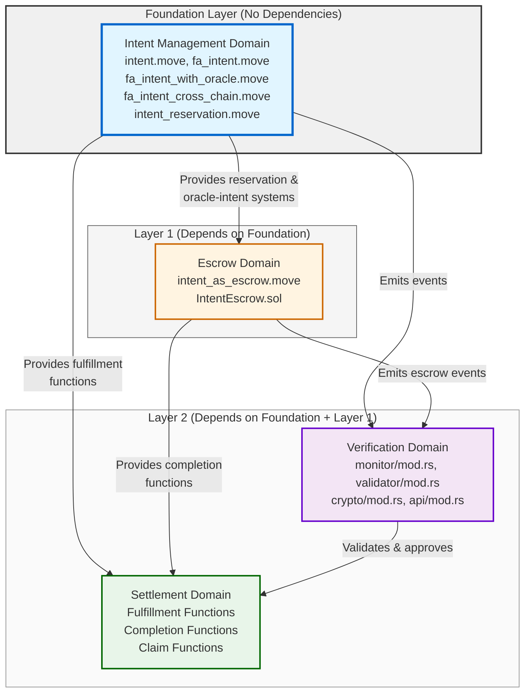
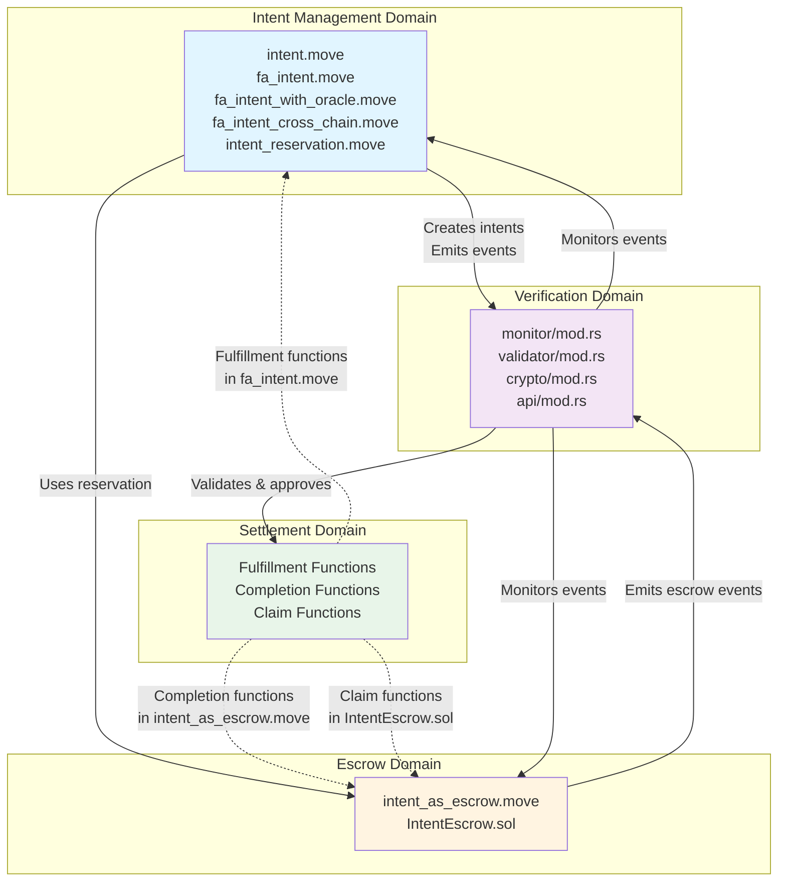

# Component-to-Domain Mapping Analysis

This document provides a comprehensive mapping of all source files in the Intent Framework to their respective domains. A domain is a logical grouping of related functionality that handles a specific set of responsibilities within the system. Domains organize the codebase into major functional areas with the following characteristics:

- Each domain has a clear purpose and responsibility
- Components (source files) belong to domains based on their functionality
- Domains interact with each other while maintaining clear boundaries
- This organization facilitates understanding of system interactions

This analysis forms the foundation for the architecture document.

## Topological Order (Build Sequence)

Following RPG methodology, domains are organized in topological order from foundation to dependent layers:

**Build Order**:

1. **Foundation**: Intent Management (implement first - no dependencies)
2. **Layer 1**: Escrow (depends on Intent Management)
3. **Layer 2**: Settlement and Verification (depend on Foundation + Layer 1)

## Domain Architecture Overview

This diagram shows all domain relationships and interactions, while the Topological Order diagram above focuses on build sequence and layering.

## Domain Definitions

### 1. Intent Management Domain

**Responsibility**: Core intent creation, validation, and lifecycle management. Handles intent types, witness systems, reservation mechanisms, and event emissions.

**Key Characteristics**:

- Manages intent lifecycle (creation, expiry, revocation)
- Enforces type-safe witness validation
- Handles intent reservation for specific solvers
- Emits events for external monitoring

### 2. Escrow Domain

**Responsibility**: Asset custody and conditional release mechanisms on connected chains. Handles fund locking on individual chains, verifier integration, and escrow-specific security requirements. The cross-chain aspect comes from escrows being created on chains different from where intents are created (hub chain).

**Key Characteristics**:

- Locks assets awaiting verifier approval
- Enforces non-revocable requirement (CRITICAL security constraint)
- Supports both Move and EVM implementations
- Manages reserved solver addresses

### 3. Settlement Domain

**Responsibility**: Transaction completion and finalization processes across chains. Handles intent fulfillment, escrow release, and asset transfers.

**Note**: Unlike other domains, Settlement is not a separate module but rather represents completion/finalization functionality distributed across Intent Management and Escrow modules. This reflects the architectural pattern where settlement is the natural conclusion of intent/escrow operations.

**Key Characteristics**:

- Processes intent fulfillment by solvers
- Releases escrowed funds upon verifier approval
- Coordinates cross-chain asset transfers
- Handles expiry and cancellation scenarios

### 4. Verification Domain

**Responsibility**: Trusted verifier service that monitors chain events, validates cross-chain state, and provides cryptographic approvals for escrow releases.

**Key Characteristics**:

- Monitors events from multiple chains
- Validates cross-chain state consistency
- Generates cryptographic approval signatures
- Provides REST API for external integration

---

## Component Mapping

### Intent Management Domain

#### Core Intent Framework

- **`move-intent-framework/sources/intent.move`**
  - **Purpose**: Generic intent framework providing abstract structures and functions
  - **Key Structures**: `TradeIntent<Source, Args>`, `TradeSession<Args>`
  - **Key Functions**: `create_intent()`, `start_intent_session()`, `finish_intent_session()`, `revoke_intent()`
  - **Responsibilities**: Intent lifecycle, witness validation, expiry handling, revocation logic

#### Fungible Asset Intent Implementation

- **`move-intent-framework/sources/fa_intent.move`**
  - **Purpose**: Fungible asset trading intent implementation
  - **Key Structures**: `FungibleAssetLimitOrder`, `FungibleStoreManager`, `FungibleAssetRecipientWitness`
  - **Key Functions**: `create_fa_to_fa_intent()`, `fulfill_cross_chain_request_intent()`
  - **Key Events**: `LimitOrderEvent`, `LimitOrderFulfillmentEvent`
  - **Responsibilities**: FA-specific intent creation, fulfillment logic, event emission

#### Oracle-Guarded Intent Implementation

- **`move-intent-framework/sources/fa_intent_with_oracle.move`**
  - **Purpose**: Oracle signature requirement layer on top of base intent mechanics
  - **Key Structures**: `OracleGuardedLimitOrder`, `OracleSignatureRequirement`
  - **Key Functions**: `create_fa_to_fa_intent_with_oracle()`, `start_oracle_intent_session()`, `finish_oracle_intent_session()`
  - **Key Events**: `OracleLimitOrderEvent`
  - **Responsibilities**: Oracle signature verification, threshold validation

#### Cross-Chain Intent Creation

- **`move-intent-framework/sources/fa_intent_cross_chain.move`**
  - **Purpose**: Cross-chain request intent creation (tokens locked on different chain)
  - **Key Functions**: `create_cross_chain_request_intent()`, `create_cross_chain_request_intent_entry()`
  - **Responsibilities**: Creates reserved intents with `intent_id` for cross-chain linking, zero-amount source (tokens on other chain). Uses solver registry to verify solver signatures.

#### Intent Reservation System

- **`move-intent-framework/sources/intent_reservation.move`**
  - **Purpose**: Reserved intent system for specific solver addresses
  - **Key Structures**: `IntentReserved`, `IntentToSign`, `IntentDraft`
  - **Key Functions**: `verify_and_create_reservation()`, `verify_and_create_reservation_from_registry()`
  - **Responsibilities**: Solver reservation, signature verification for reserved intents. Supports both authentication key extraction (old format) and registry-based lookup (new format, cross-chain).

#### Solver Registry

- **`move-intent-framework/sources/solver_registry.move`**
  - **Purpose**: On-chain registry for solver public keys and EVM addresses
  - **Key Structures**: `SolverRegistry`, `SolverInfo`
  - **Key Functions**: `register_solver()`, `update_solver()`, `deregister_solver()`, `get_public_key()`, `get_evm_address()`
  - **Responsibilities**: Stores solver Ed25519 public keys for signature verification and EVM addresses for cross-chain escrow creation. Required for cross-chain intents and accounts with new authentication key format.

#### Test Utilities

- **`move-intent-framework/sources/test_fa_helper.move`**
  - **Purpose**: Test helper utilities for intent framework testing
  - **Domain**: Testing infrastructure (not part of production domains)

---

### Escrow Domain

#### Move-Based Escrow

- **`move-intent-framework/sources/intent_as_escrow.move`**
  - **Purpose**: Simplified escrow abstraction using oracle-intent system
  - **Key Structures**: `EscrowConfig`
  - **Key Functions**: `create_escrow()`, `start_escrow_session()`, `complete_escrow()`
  - **Security**: **CRITICAL** - Enforces non-revocable requirement (`revocable = false`)
  - **Responsibilities**: Escrow creation, session management, verifier approval handling

- **`move-intent-framework/sources/intent_as_escrow_entry.move`**
  - **Purpose**: Entry function wrappers for CLI convenience
  - **Key Functions**: `create_escrow_from_fa()`, `complete_escrow_from_fa()`
  - **Responsibilities**: User-friendly entry points for escrow operations

#### EVM-Based Escrow

- **`evm-intent-framework/contracts/IntentEscrow.sol`**
  - **Purpose**: Solidity escrow contract for EVM chains
  - **Key Structures**: `Escrow` struct
  - **Key Functions**: `createEscrow()`, `deposit()`, `claim()`, `cancel()`
  - **Key Events**: `EscrowInitialized`, `DepositMade`, `EscrowClaimed`, `EscrowCancelled`
  - **Security**: Enforces reserved solver addresses, expiry-based cancellation
  - **Responsibilities**: EVM escrow creation, fund locking, verifier signature verification, fund release

#### Mock Contracts (Testing)

- **`evm-intent-framework/contracts/MockERC20.sol`**
  - **Purpose**: Mock ERC20 token for testing
  - **Domain**: Testing infrastructure (not part of production domains)

---

### Settlement Domain

#### Intent Fulfillment (Move)

- **`move-intent-framework/sources/fa_intent.move`** (fulfillment functions)
  - **Key Functions**: `fulfill_cross_chain_request_intent()`, `finish_fa_intent_session()`
  - **Responsibilities**: Processes solver fulfillment, validates conditions, transfers assets

#### Escrow Completion (Move)

- **`move-intent-framework/sources/intent_as_escrow.move`** (completion functions)
  - **Key Functions**: `complete_escrow()`
  - **Responsibilities**: Verifies verifier approval, releases escrowed funds to solver

#### Escrow Claim (EVM)

- **`evm-intent-framework/contracts/IntentEscrow.sol`** (claim function)
  - **Key Functions**: `claim()`
  - **Responsibilities**: Verifies verifier signature, transfers funds to reserved solver

#### Escrow Cancellation

- **`evm-intent-framework/contracts/IntentEscrow.sol`** (cancel function)
  - **Key Functions**: `cancel()`
  - **Responsibilities**: Returns funds to maker after expiry

---

### Verification Domain

#### Event Monitoring

- **`trusted-verifier/src/monitor/mod.rs`**
  - **Purpose**: Monitors blockchain events from hub and connected chains (both Aptos and EVM)
  - **Key Structures**: `IntentEvent`, `EscrowEvent`, `FulfillmentEvent`, `EventMonitor`
  - **Key Functions**: `poll_hub_events()`, `poll_connected_events()`, `poll_evm_events()`, `monitor_hub_chain()`, `monitor_connected_chain()`, `monitor_evm_chain()`, `get_cached_events()`
  - **Responsibilities**: Event polling from multiple chains, caching (both Aptos and EVM escrows), cross-chain event correlation, symmetrical handling of Aptos and EVM escrows

#### Cross-Chain Validation

- **`trusted-verifier/src/validator/mod.rs`**
  - **Purpose**: Validates cross-chain state consistency and escrow safety
  - **Key Structures**: `ValidationResult`, `CrossChainValidator`
  - **Key Functions**: `validate_intent_safety()`, `validate_fulfillment()`, `validate_escrow_safety()`
  - **Security**: **CRITICAL** - Validates `revocable = false` requirement
  - **Responsibilities**: Intent safety checks, fulfillment validation, approval decision logic

#### Cryptographic Operations

- **`trusted-verifier/src/crypto/mod.rs`**
  - **Purpose**: Cryptographic operations for approval signatures
  - **Key Structures**: `ApprovalSignature`, `CryptoService`
  - **Key Functions**: `sign_approval()`, `verify_signature()`, `get_public_key()`
  - **Responsibilities**: Ed25519 (Aptos) and ECDSA (EVM) signature generation/verification

#### REST API Server

- **`trusted-verifier/src/api/mod.rs`**
  - **Purpose**: REST API for external system integration
  - **Key Endpoints**: `/health`, `/public-key`, `/events`, `/approvals`, `/approval`
  - **Key Structures**: `ApiServer`, `ApiResponse<T>`
  - **Responsibilities**: HTTP request handling, event/approval retrieval, manual approval creation

#### Configuration Management

- **`trusted-verifier/src/config/mod.rs`**
  - **Purpose**: Service configuration management
  - **Key Structures**: `Config`, `ChainConfig`, `EvmChainConfig`, `VerifierConfig`, `ApiConfig`
  - **Responsibilities**: Configuration loading, validation, chain-specific settings

#### Aptos Client

- **`trusted-verifier/src/aptos_client.rs`**
  - **Purpose**: Aptos blockchain client for event querying
  - **Key Functions**: `get_events()`, `get_limit_order_events()`, `get_escrow_events()`, `get_intent_solver()`, `get_solver_evm_address()`, `call_view_function()`
  - **Responsibilities**: Blockchain RPC communication, event parsing, solver registry queries

#### EVM Client

- **`trusted-verifier/src/evm_client.rs`**
  - **Purpose**: EVM blockchain client for event querying via JSON-RPC
  - **Key Functions**: `get_escrow_initialized_events()`, `get_block_number()`
  - **Responsibilities**: EVM JSON-RPC communication, event log parsing, EscrowInitialized event extraction

#### Core Library

- **`trusted-verifier/src/lib.rs`**
  - **Purpose**: Library root, re-exports common types
  - **Responsibilities**: Module organization, public API definition

#### Main Entry Point

- **`trusted-verifier/src/main.rs`**
  - **Purpose**: Application entry point
  - **Responsibilities**: Service initialization, event loop orchestration

#### Utility Binaries

- **`trusted-verifier/src/bin/generate_keys.rs`**
  - **Purpose**: Key pair generation utility
  - **Domain**: Development tooling

- **`trusted-verifier/src/bin/get_verifier_eth_address.rs`**
  - **Purpose**: Derive Ethereum address from Ed25519 key
  - **Domain**: Development tooling

---

## Inter-Domain Interaction Patterns and Dependencies

This section documents comprehensive communication patterns between domains, including event flows, data sharing, API calls, and error handling. Dependencies follow topological order: Foundation → Layer 1 → Layer 2.

### Event Flow Patterns

**Intent Management → Verification** (Event Emission):

- `LimitOrderEvent`: Emitted when intent is created (`fa_intent.move`)
  - Contains: `intent_id`, `source_metadata`, `source_amount`, `desired_metadata`, `desired_amount`, `expiry_time`, `revocable`
  - Purpose: Verifier monitors for new intents requiring validation
- `LimitOrderFulfillmentEvent`: Emitted when intent is fulfilled (`fa_intent.move`)
  - Contains: `intent_id`, `solver`, `provided_metadata`, `provided_amount`, `timestamp`
  - Purpose: Verifier validates fulfillment before approving escrow release
- `OracleLimitOrderEvent`: Emitted for oracle-guarded intents (`fa_intent_with_oracle.move`)
  - Contains: Same as `LimitOrderEvent` plus `min_reported_value`
  - Purpose: Used by escrow system and monitored by verifier

**Escrow → Verification** (Event Emission):

- `OracleLimitOrderEvent` (Move): Emitted when escrow is created (`intent_as_escrow.move`)
  - Contains: Escrow details with `intent_id` for cross-chain correlation, `reserved_solver`
  - Purpose: Verifier monitors Aptos escrow creation and validates safety
  - Monitoring: Verifier actively polls Aptos connected chain and caches escrows when created
- `EscrowInitialized` (EVM): Emitted when escrow is created (`IntentEscrow.sol`)
  - Contains: `intentId`, `maker`, `token`, `reservedSolver`
  - Purpose: Verifier monitors EVM escrow creation and validates safety
  - Monitoring: Verifier actively polls EVM connected chain and caches escrows when created (symmetrical with Aptos)
- `EscrowClaimed`, `EscrowCancelled` (EVM): Emitted on escrow completion/cancellation
  - Purpose: Verifier tracks escrow lifecycle

**Verification → Settlement** (Approval Provision):

- Approval signatures provided via REST API (`/approvals/:escrow_id`) or direct function calls
- Contains: Cryptographic signature (Ed25519 for Move, ECDSA for EVM), approval value
- Purpose: Settlement uses signatures to authorize escrow release

### Functional Dependencies

**Escrow → Intent Management** (Layer 1 → Foundation):

- **Reservation System**: Escrow uses `IntentReserved` structure from `intent_reservation.move` to enforce reserved solver addresses
- **Oracle-Intent System**: Escrow implementation uses `fa_intent_with_oracle.move` for oracle-guarded intent mechanics
- **Function Calls**: `create_escrow()` internally uses `create_fa_to_fa_intent_with_oracle()` from Intent Management

**Settlement → Intent Management** (Layer 2 → Foundation):

- **Fulfillment Functions**: Settlement calls `fulfill_cross_chain_request_intent()` and `finish_fa_intent_session()` from `fa_intent.move`
- **Witness Validation**: Settlement uses witness type system from `intent.move` to validate fulfillment conditions
- **Session Management**: Settlement consumes `TradeSession` hot potato types from Intent Management

**Settlement → Escrow** (Layer 2 → Layer 1):

- **Completion Functions**: Settlement calls `complete_escrow()` (Move) or `claim()` (EVM) to release escrowed funds
- **Approval Verification**: Settlement verifies verifier signatures before releasing funds
- **Reserved Solver Enforcement**: Settlement ensures funds go to reserved solver regardless of transaction sender

**Verification → Intent Management** (Layer 2 → Foundation):

- **Event Monitoring**: Verifier polls `LimitOrderEvent` and `LimitOrderFulfillmentEvent` via blockchain RPC
- **Safety Validation**: Verifier calls `validate_intent_safety()` to check intent requirements (expiry, revocability)
- **Fulfillment Validation**: Verifier calls `validate_fulfillment()` to verify fulfillment conditions match intent

**Verification → Escrow** (Layer 2 → Layer 1):

- **Event Monitoring**: Verifier polls `OracleLimitOrderEvent` (Move) and `EscrowInitialized` (EVM) actively
- **Symmetrical Monitoring**: Both Aptos and EVM escrows are monitored, cached, and validated when created (not retroactively)
- **Safety Validation**: Verifier calls `validate_intent_fulfillment()` to ensure `revocable = false` (CRITICAL) and validates solver addresses match
- **Solver Validation**: For Aptos escrows, compares Aptos addresses directly; for EVM escrows, queries solver registry for EVM address and compares
- **Chain ID Validation**: Verifier validates that escrow `chain_id` matches intent `connected_chain_id`
- **Approval Generation**: Verifier calls `create_approval_signature()` (Ed25519) or `create_evm_approval_signature()` (ECDSA) to generate cryptographic signatures for escrow release

### Data Flow Patterns

**Cross-Chain Correlation**:

- `intent_id` field links intents on hub chain to escrows on connected chains
- Verifier uses `intent_id` to match events across chains via `match_events_by_intent_id()`
- Data flows: Hub Intent → `intent_id` → Connected Escrow → Verifier Correlation → Approval

**Reserved Solver Flow**:

- Intent Management: Provides `IntentReserved` structure with solver address
- Escrow: Stores `reserved_solver` / `reservedSolver` at creation (immutable)
- Settlement: Transfers funds to reserved solver regardless of transaction sender
- Verification: Validates reserved solver matches intent fulfillment

**Approval Signature Flow**:

- Verification: Generates approval signature using Ed25519 (Move) or ECDSA (EVM)
- Settlement: Retrieves signature via REST API (`/approvals/:escrow_id`) or cached events
- Escrow: Verifies signature matches verifier public key before releasing funds

### API Call Patterns

**External Systems → Verification**:

- `GET /events`: Retrieve cached events (intents, escrows, fulfillments)
- `GET /approvals/:escrow_id`: Retrieve approval signature for specific escrow
- `POST /approval`: Manually trigger approval generation (for testing/debugging)

**Settlement → Verification**:

- Settlement queries `/approvals/:escrow_id` to retrieve approval signatures
- Settlement validates signature format and verifier public key before use

### Error Handling and Rollback Scenarios

**Intent Expiry**:

- Intent Management: Rejects fulfillment attempts after `expiry_time`
- Settlement: Cannot fulfill expired intents
- Escrow: Can be cancelled after expiry (EVM only), returns funds to maker

**Invalid Verifier Signature**:

- Escrow: Rejects `complete_escrow()` / `claim()` calls with invalid signatures
- Settlement: Must retry with valid signature or wait for verifier approval
- Verification: Signature validation failures logged but don't prevent retry

**Escrow Safety Validation Failure**:

- Verification: Rejects escrows with `revocable = true` (CRITICAL security check)
- Escrow: Creation fails if verifier validation rejects (pre-creation validation)
- Settlement: Cannot proceed if verifier hasn't approved

**Cross-Chain Correlation Failure**:

- Verification: Cannot match events if `intent_id` mismatch or missing
- Settlement: Cannot proceed without verifier approval (requires correlation)
- Error: Escrow remains locked until manual intervention or expiry

**Reserved Solver Mismatch**:

- Escrow: Rejects completion if reserved solver doesn't match (Move: session validation, EVM: enforced in `claim()`)
- Settlement: Funds always go to reserved solver, transaction sender irrelevant
- Verification: Validates reserved solver matches fulfillment before approval

---

## Domain Boundaries and Interfaces

Detailed architectural definitions of domain boundaries, external interfaces, internal components, data ownership, and interaction protocols are documented internally in `.taskmaster/docs/domain-boundaries-and-interfaces.md`. This internal document follows RPG methodology principles and serves as architectural guidance for development decisions.

---

## Domain Boundaries Summary

This table provides a concise overview of domain boundaries, listing the primary source files for each domain and their core responsibilities. It serves as a quick reference for understanding which components belong to which domain and what each domain's primary function is within the Intent Framework system.

| Domain | Primary Files | Key Responsibility |
|--------|--------------|-------------------|
| **Intent Management** | `intent.move`, `fa_intent.move`, `fa_intent_with_oracle.move`, `fa_intent_cross_chain.move`, `intent_reservation.move` | Intent lifecycle, creation, validation, event emission |
| **Escrow** | `intent_as_escrow.move`, `intent_as_escrow_entry.move`, `IntentEscrow.sol` | Asset custody, fund locking, verifier integration |
| **Settlement** | Functions in `fa_intent.move`, `intent_as_escrow.move`, `IntentEscrow.sol` | Intent fulfillment, escrow completion, asset transfers |
| **Verification** | `monitor/mod.rs`, `validator/mod.rs`, `crypto/mod.rs`, `api/mod.rs`, `config/mod.rs`, `aptos_client.rs`, `evm_client.rs` | Event monitoring (hub, Aptos, EVM), cross-chain validation, approval signatures (Ed25519 & ECDSA) |
