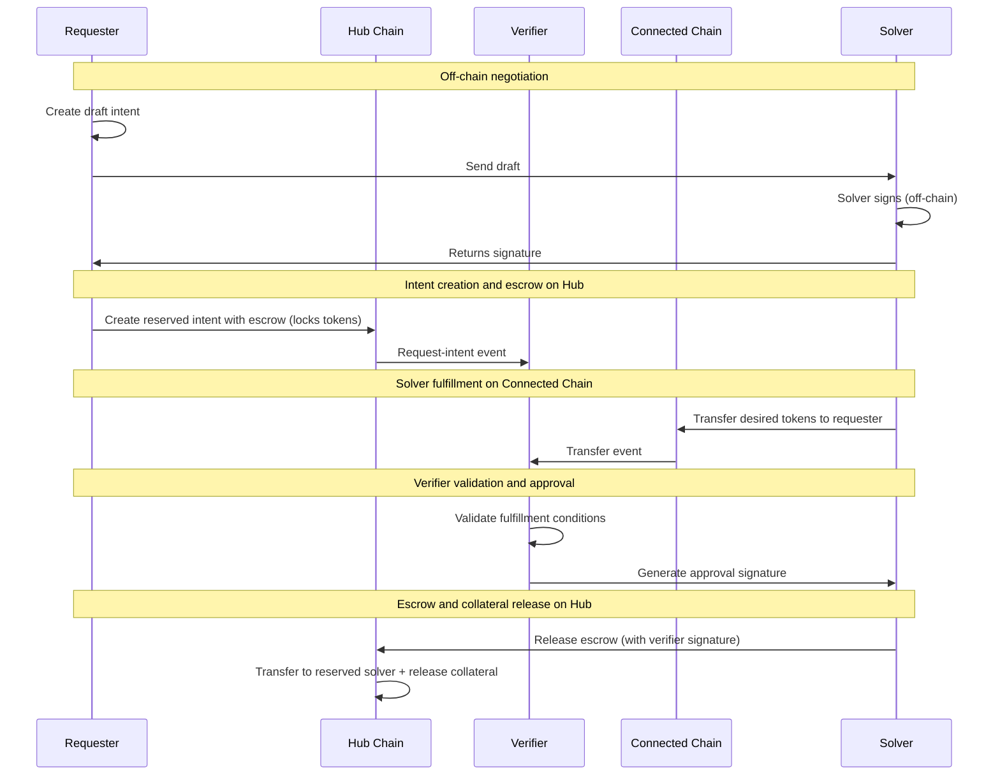

# Conception - Outflow Flow

This document describes the Outflow flow (Hub → Connected Chain). For general concepts, actors, and terminology, see [conception_generic.md](conception_generic.md).

## Use cases

For general use cases applicable to all flows, see [conception_generic.md](conception_generic.md). This section focuses on outflow-specific use cases.

### Users (Requester)

- As a requester, I want to swap some USDhub from M1 chain to a connected chain so that I get my USDcon on the connected chain fast and with low fee.

## Protocol

## Scenarios

### Requester makes an outflow swap intent

0. Given the requester
   - owns the USDhub that they want to transfer on M1 chain
   - owns some MOVE to execute Tx on M1 chain
   - can access the connected chain and M1 chain RPC
1. When the requester wants to realize a swap from M1 chain to connected chain
   - then the requester requests a signed quote from a solver for the desired intent
   - then the requester sends a request-intent Tx to the M1 chain with escrow (locks tokens on Hub)
   - then the requester waits for a confirmation of the swap
   - then the requester has received the requested amount of USDcon in their connected chain account.

#### Possible issues (Requester)

1. The requester didn't get the right expected amount of USDcon on connected chain.
    - _Mitigation: The verifier verifies that the transfer amount on connected chain matches the request-intent desired amount. Only if the amount is correct, the verifier signs the approval for escrow release._
2. The solver never fulfills on connected chain. How can the requester withdraw their tokens?
    - _Mitigation: The escrow on Hub eventually times out and the requester can withdraw their tokens._

### Solver resolves an outflow swap intent

0. Given the solver
   - is registered in the solver registry on Hub chain
   - owns some MOVE to execute Tx on M1 chain
   - owns enough USDcon on the connected chain
   - can access both chains' RPC
1. When the requester creates a draft intent and sends it to the solver
   - Then the solver signs the draft intent off-chain and returns signature
2. When the requester creates the reserved request-intent with escrow on Hub chain
   - Then the solver observes the request-intent event
   - Then the solver transfers the desired tokens to the requester on the connected chain
   - Then the solver waits for verifier validation and approval
   - Then the solver claims the escrow funds on Hub chain

#### Possible issues (Solver)

- The solver doesn't send the right amount of desired tokens to the requester on the desired connected chain.
  - _Mitigation: The verifier verifies that the transfer amount matches the request-intent desired amount before signing approval. Only if the amount is correct, the verifier signs the approval for escrow release._
- The solver doesn't receive the correct amount from escrow on Hub chain.
  - _Mitigation: The request-intent is created with the correct offered amount. If the amount is incorrect the request-intent will fail to be created. This is also protected on contract side through checking the signature of the solver._
- The solver is not notified of new request-intent events.
  - _Mitigation: The verifier receives intent-requests from the contract and can be queried by the solver._
- The solver attempts to fulfill an intent that wasn't reserved for them.
  - _Mitigation: The contract rejects the fulfillment if the intent is not reserved for the solver._
- The solver provides the wrong token type on connected chain.
  - _Mitigation: The verifier verifies that the token metadata matches the desired_metadata. If the token type is incorrect, no approval signature is given._
- The verifier signature verification fails during escrow release on Hub.
  - _Mitigation: The Hub contract verifies the verifier signature. If verification fails, the release transaction aborts and funds remain locked until a valid signature is provided or the escrow expires._

### The requester is adverse

0. Given the adversary takes the requester role to do a swap
1. When the adversary wants to extract more funds than the adversary has provided
   - Then the adversary sends a request-intent Tx to the M1 chain with less tokens in escrow than declared.
   - Then the adversary hopes to get more USDcon on the connected chain than they have provided on the hub.
   - _Mitigation: The escrow amount is locked at request-intent creation. The contract enforces the offered amount._
2. When the adversary attempts to stall the request-intent holding solver funds hostage.
   - Then the adversary creates the intent
   - Then the adversary takes no action
   - _Mitigation: The solver observes the request-intent event before fulfilling on the desired connected chain. If the requester doesn't create the request-intent, the solver simply doesn't fulfill._

### The solver is adverse

0. Given the adversary takes the solver role to resolve an intent
1. When the adversary attempts to transfer less than the desired amount
   - Then the adversary reserves the request-intent
   - Then the adversary transfers less funds than expected to the requester account on connected chain.
   - Then the adversary hopes that the escrow is released.
   - _Mitigation: The verifier verifies the transfer amount and type on connected chain before signing approval. If amount is incorrect or type is incorrect, no approval is given._
2. When the adversary attempts to stall the request-intent.
   - Then the adversary reserves the request-intent
   - Then the adversary takes no action
   - _Mitigation: The request-intent is protected by a timeout mechanism. After timeout, the request-intent is cancelled and the funds are returned to the requester._

## Error Cases

- **Connected-chain transfer failure**: Solver transfer fails or reverts; verifier never signs, hub escrow remains locked until expiry.
- **Transfer mismatch**: Transfer amount, recipient, or token metadata does not match the intent; verifier rejects the fulfillment proof.
- **Missing intent linkage**: Connected-chain transfer lacks intent metadata (memo/calldata); verifier rejects.
- **Invalid approval signature**: Hub escrow release fails when the verifier signature does not match the intent.
- **Expiry reached**: Hub escrow cannot be released after expiry; requester can cancel instead.

## Protocol steps details

Steps 1-3 are generic to all flows. See [conception_generic.md](conception_generic.md#generic-protocol-steps) for details. Apart from step 3, which in addition to the generic steps, adds the following step 3a).

### 3a) Requester locks offered amount on Hub chain

The request-intent serves a dual purpose: it is the intent to be fulfilled and it is the escrow for the offered amount + fee tokens.
The request-intent is created with the correct offered amount + fee tokens.

### 5) Solver detects and verifies intent

The solver monitors request-intent events on Hub chain to detect when the requester has created the request-intent. The solver verifies that the requester has locked the correct funds in the request-intent and that the intent is reserved for the solver.

Alternatively, the verifier monitors the intent events and the solver can query the verifier.

### 6) Solver fulfills on connected chain

The solver transfers the desired amount to the requester on the connected chain.

To verify the Solver transfer, the verifier needs a proof. We can use the transfer Tx as proof, but we need to have a way to validate that the Tx hasn't been executed for another purpose. For this purpose, we add the `intent_id` to the transfer Tx as metadata. Or we develop a specific function that does the transfer and links it to the intent. The choice will depend on the proof we'll use to determine if the Solver has executed the transfer.

### 7) Verifier verifies the execution of all legs and signs

The verifier verifies the correct execution of all legs:

1. **Escrow verification** (Hub chain): The verifier verifies that the requester has locked the correct offered amount + fee in the escrow on Hub chain, linked to the correct `intent_id`.

2. **Fulfillment verification** (connected chain): The verifier verifies that the solver has transferred the correct desired amount to the requester on the connected chain, linked to the correct `intent_id`.

After successful verification, the verifier signs an approval for escrow release.

### 8) Escrow release on Hub

The verifier or the solver (with verifier signature) releases the escrow on Hub chain. The offered amount + solver fee is transferred to the solver account.

(Optional) Deducts fixed protocol fee → Treasury.

### 9) Verifier free solver collateral

The solver's collateral is released. This is done together with the escrow release as this indicates successful fulfillment.

### 10) Verifier closes the intent

(Optional) The verifier updates the intent status to closed.
Updates exposure metrics.

Steps 8, 9, and 10 are done in the same Hub chain call.
