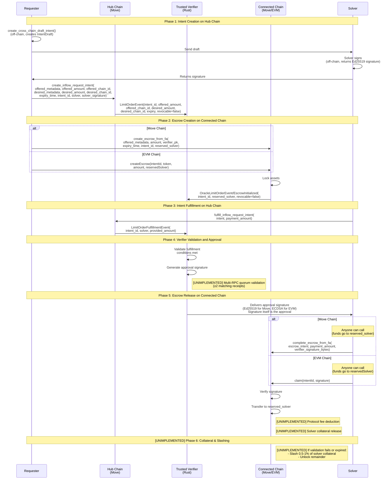
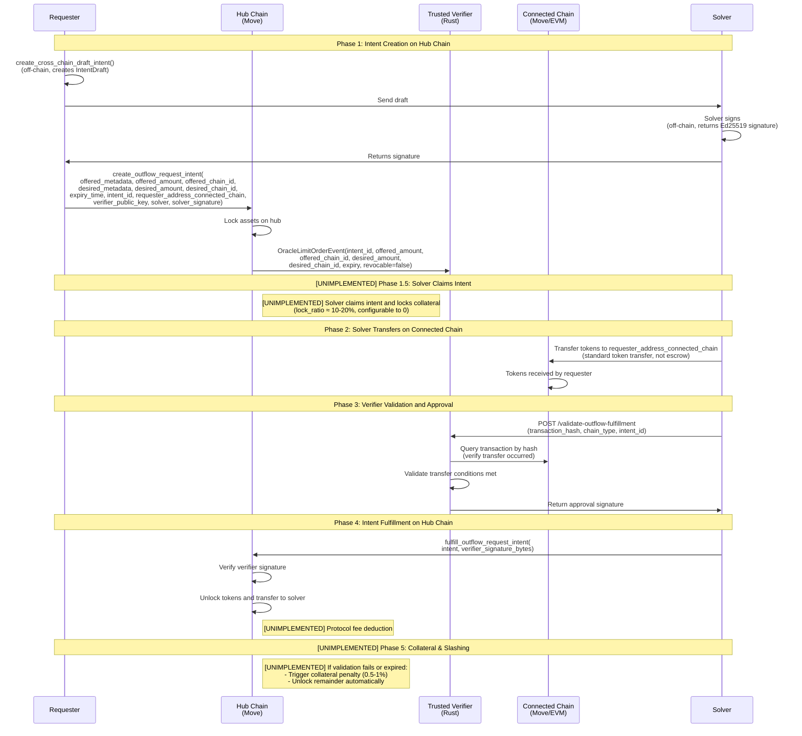
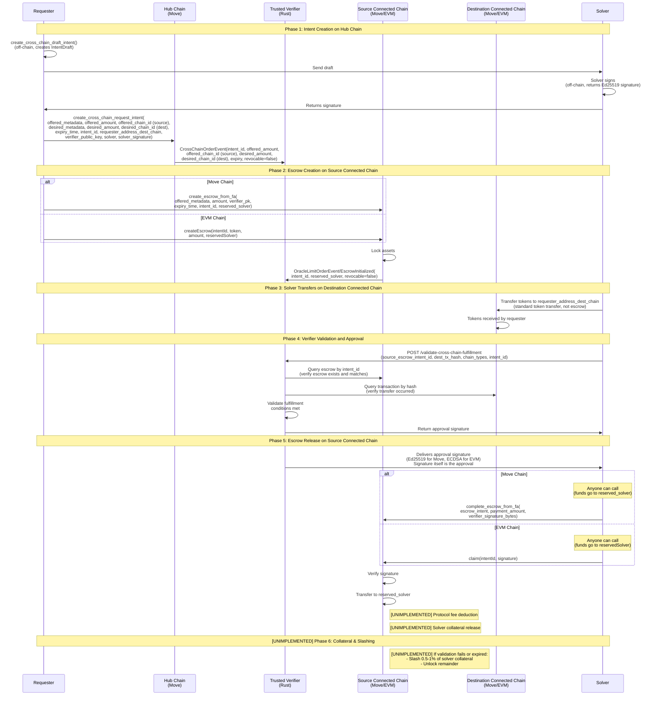

# Requirements Document

> **Note**: This is a working document and may be deleted once sufficient progress has been made and the requirements are reflected in the implementation and other documentation.

## Document Scope

This document specifies **requirements** for the Intent Framework—what the system must support and how it should behave. It focuses on requirements not covered in the other taskmaster architecture documents:

- **[Section 2: Cross-Chain Architecture](#2-system-overview)** - Cross-chain flow requirements (Inflow and Outflow) with sequence diagrams. Diagrams show implemented flow with future enhancements marked in bold.

- **[Section 3: Functional Requirements](#3-functional-requirements)** - High-level functional capabilities the system must support.

- **[Section 4: Non-Functional Requirements](#4-non-functional-requirements)** - System-level quality attributes (reliability, availability, usability, compatibility) not covered by architecture docs.

- **[Section 5: Performance Requirements](#5-performance-requirements)** - (Empty)

- **[Section 6: Deployment Requirements](#6-deployment-requirements)** - (Empty)

- **[Section 7: Testing Requirements](#7-testing-requirements)** - Testing capabilities the system must support.

- **[Section 8: Constraints and Assumptions](#8-constraints-and-assumptions)** - (Empty)

- **[Section 9: Future Enhancements](#9-future-enhancements)** - (Empty)

## 1. Introduction

The Intent Framework is a system for creating conditional trading intents. It enables users to create time-bound, conditional offers that can be executed by third parties (solvers) when specific conditions are met. The framework provides a generic system for creating tradeable intents with built-in expiry, witness validation, and owner revocation capabilities, enabling sophisticated trading mechanisms like limit orders and conditional swaps.

The system consists of two primary components:

- **Move Intent Framework**: A set of Move smart contracts that implement the core intent creation, management, and execution logic. The framework supports multiple intent types including unreserved intents (executable by any solver), reserved intents (pre-authorized solvers), and oracle-guarded intents (conditional on external data validation).

- **Trusted Verifier Service**: A Rust-based external service that monitors intent events on the hub chain, validates fulfillment conditions across connected chains, and provides cryptographic approvals for intent and escrow completion in cross-chain scenarios.

The framework can also function as an escrow mechanism, allowing funds to be locked and released based on verified conditions. This makes it suitable for applications requiring conditional payments, cross-chain trades, and other scenarios where execution depends on external state verification.

## 2. System Overview

The system follows a modular architecture with clear separation between on-chain smart contract logic and off-chain verification services. For detailed component organization and domain boundaries, see [Component-to-Domain Mapping](architecture-component-mapping.md) and [Domain Boundaries and Interfaces](domain-boundaries-and-interfaces.md).

### 2.1 Cross-Chain Architecture

For cross-chain scenarios, the system operates with a hub-and-spoke model:

- **Hub Chain**: Hosts intent creation and final settlement
- **Connected Chains**: Host escrow deposits and conditional resource locking
- **Trusted Verifier**: Acts as a bridge service monitoring both hub and connected chains, validating cross-chain conditions, and providing cryptographic proofs

The verifier ensures that escrow operations on connected chains match the intent requirements on the hub chain before providing approval signatures.

#### Cross-Chain Flows

The cross-chain intent protocol supports three primary flows: **Inflow** (Connected Chain → Hub), **Outflow** (Hub → Connected Chain), and **Connected → Connected** (Connected Chain → Connected Chain). These flows enable smooth "deposit → instant credit" UX while maintaining system security through solver collateral and partial slashing mechanisms.

##### Inflow (Connected Chain → Movement)

This flow enables users to deposit offered tokens on a connected chain and receive desired tokens on Movement (hub chain).

**Implementation Details**: See [Inflow Flow Steps](../../docs/protocol.md#inflow-flow-steps) in `protocol.md` for the complete implemented flow.

**Future Enhancements (NOT YET IMPLEMENTED)**:

- **Multi-RPC Quorum**: Verifier uses multiple RPC endpoints with quorum validation (≥2 matching receipts) for enhanced security
- **Protocol Fees**: Automatic fee deduction from escrow transfers to solver
- **Solver Collateral**: Solvers lock collateral that can be slashed (0.5-1%) if validation fails or intent expires
- **Bypass/Verifier-Gated Modes**: Alternative flow modes where verifier commits transactions on behalf of users

##### Outflow (Movement → Connected Chain)

This flow enables users to lock offered tokens on Movement (hub chain) and receive desired tokens on a connected chain.

**Implementation Details**: See [Outflow Flow Steps](../../docs/protocol.md#outflow-flow-steps) in `protocol.md` for the complete implemented flow.

**Future Enhancements (NOT YET IMPLEMENTED)**:

- **Solver Claims Intent**: Solver claims the intent, locking a portion of its long-term collateral (`lock_ratio ≈ 10-20%`, configurable to 0)
- **Protocol Fees**: Automatic fee deduction from hub token transfers to solver
- **Collateral Penalty**: If validation fails or intent expires, trigger collateral penalty (0.5-1%) and unlock remainder
- **Bypass/Verifier-Gated Modes**: Alternative flow modes where verifier commits transactions on behalf of users

##### Connected → Connected (Connected Chain → Connected Chain)

This flow enables users to transfer tokens from one connected chain to another connected chain, with tokens locked on the source connected chain and desired on the destination connected chain.

**Implementation Details**: This flow combines elements of both inflow and outflow:

- **Hub request-intent**: Similar to both inflow and outflow, creates a cross-chain intent on the hub chain
- **Source connected chain escrow-intent**: Like inflow, tokens are locked in escrow on the source connected chain
- **Destination connected chain fulfill transaction**: Like outflow, solver transfers tokens directly on the destination connected chain

**Future Enhancements (NOT YET IMPLEMENTED)**:

- **Multi-RPC Quorum**: Verifier uses multiple RPC endpoints with quorum validation (≥2 matching receipts) for enhanced security
- **Protocol Fees**: Automatic fee deduction from escrow transfers to solver
- **Solver Collateral**: Solvers lock collateral that can be slashed (0.5-1%) if validation fails or intent expires
- **Bypass/Verifier-Gated Modes**: Alternative flow modes where verifier commits transactions on behalf of users

### 2.2 Architectural Principles

For detailed architectural principles and design philosophy, see the [Architecture Documentation](README.md):

- **[RPG Methodology Principles](rpg-methodology.md)** - Design philosophy and domain-based organization principles
- **[Component-to-Domain Mapping](architecture-component-mapping.md)** - How components are organized into domains and inter-domain interaction patterns
- **[Domain Boundaries and Interfaces](domain-boundaries-and-interfaces.md)** - Precise domain boundary definitions and interface specifications

## 3. Functional Requirements

This section specifies functional capabilities that the system must support. For detailed interface specifications, data structures, and current implementation details, see [Domain Boundaries and Interfaces](domain-boundaries-and-interfaces.md), [Data Models Documentation](data-models.md), and [Use Cases and Scenarios Documentation](use-cases.md).

### 3.1 Intent Creation and Execution

The system must support creating and executing intents with the following capabilities:

- **Unreserved Intent Creation**: Create intents executable by any solver
- **Reserved Intent Creation**: Enable off-chain negotiation and solver signature verification (Ed25519) to authorize specific solvers
- **Oracle-Guarded Intent Creation**: Create intents with external data validation requirements and oracle signature verification
- **Escrow Intent Creation**: Create escrow intents for conditional payments with verifier approval requirements
- **Move On-Chain Intent Execution**: Support two-phase session model (`start_intent_session()`, `finish_intent_session()`) for intents fulfilled entirely on a single chain
- **Intent Revocation**: Support revoking intents by creator (if `revocable = true`)
- **Expiry Handling**: Automatically prevent execution of expired intents
- **Event Emission**: Emit events for intent discovery and cross-chain coordination

### 3.2 Cross-Chain Intent Execution

For cross-chain intent flows involving multiple chains and verifiers, see [Cross-Chain Flows](#cross-chain-flows) (Inflow and Outflow). The system must support:

- Solver fulfillment submission with cross-chain transaction references (`fill_intent(intent_id, tx_hash)`)
- Cross-chain transaction validation with multi-RPC quorum (≥2 matching receipts)
- Verifier finalization with collateral management and slashing mechanisms
- Instant credit model where solver provides tokens before verification completes

### 3.3 Trusted Verifier Service

The system must provide a verifier service with the following capabilities:

- **Event Monitoring**: Monitor blockchain events from hub and connected chains, cache and process events in real-time
- **Cross-Chain Validation**: Validate escrow deposits match intent requirements, verify intent ID matching, validate metadata and amounts
- **Approval/Rejection Service**: Generate Ed25519 signatures for approval/rejection decisions, expose via REST API
- **Security Validation**: Enforce non-revocable escrow requirement, validate cryptographic signatures
- **REST API**: Provide health check, event queries, approval signature creation, and public key retrieval endpoints

## 4. Non-Functional Requirements

### 4.1 Reliability & Availability

#### 4.1.1 Verifier Service Availability

- Verifier service must maintain high availability for cross-chain operations
- Support graceful shutdown and restart without data loss
- Implement event caching to prevent data loss during service downtime
- Provide health check endpoint (`GET /health`) for monitoring service status

#### 4.1.2 Event Monitoring Reliability

- Event monitoring must not miss intent or escrow events
- Support proper event discovery mechanisms (Aptos Indexer GraphQL API recommended for production)
- Implement polling intervals with configurable timeout settings
- Handle blockchain RPC failures with appropriate timeout and retry logic
- Cache processed events to enable recovery and prevent duplicate processing

#### 4.1.3 Blockchain Dependency Management

- System depends on blockchain network availability for intent operations
- Intent creation and execution require blockchain to be operational
- Escrow operations require both hub and connected chain availability
- System must handle blockchain network unavailability gracefully (fail-safe behavior)
- Intent expiry mechanism provides automatic cleanup even if verifier is unavailable

#### 4.1.4 Fault Tolerance

- Verifier service must handle validation timeouts (configurable, default 30 seconds)
- Support idempotent approval/rejection signature generation
- Handle network failures in cross-chain validation
- Provide mechanisms to recover from missed events (event replay capabilities)

#### 4.1.5 Data Persistence

- Verifier service must maintain state for last observed events across restarts
- Cache intent and escrow event data for validation and signature retrieval
- Support persistence of approval/rejection decisions

### 4.2 Usability

#### 4.2.1 API Design

- Provide clear, consistent REST API endpoints for verifier service
- Use standard HTTP status codes and error responses
- Support CORS configuration for web application integration
- Expose comprehensive event data via API (`GET /events`)
- Provide self-documenting API design with clear endpoint purposes

#### 4.2.2 Error Handling

- Return clear, descriptive error codes for all failure scenarios
- Move modules must provide specific error codes: `EINTENT_EXPIRED`, `EINVALID_SIGNATURE`, `EUNAUTHORIZED_SOLVER`, `EINVALID_AMOUNT`, `EINVALID_METADATA`, `ESIGNATURE_REQUIRED`, `EORACLE_VALUE_TOO_LOW`
- Error messages must clearly indicate the cause of failure
- Failed transactions must abort cleanly with appropriate error codes

#### 4.2.3 Developer Experience

- Provide comprehensive documentation for API usage
- Include code examples for common use cases
- Support development environment setup with clear prerequisites
- Provide configuration templates with helpful comments
- Enable easy testing and deployment workflows

#### 4.2.4 Configuration Management

- Support configuration via TOML files for verifier service
- Provide configuration templates with default values
- Enable configuration of chain endpoints, keys, timeouts, and API settings
- Support different configurations for different environments (development, production)
- Provide clear error messages when configuration is missing or invalid

#### 4.2.5 Integration Ease

- Move modules must integrate seamlessly with blockchain's native fungible asset standards
- Event-driven design enables easy external system integration
- Generic type system allows extending to new asset types without framework changes
- Support simple escrow abstraction for common use cases

### 4.3 Compatibility

#### 4.3.1 Blockchain Network Compatibility

- Support deployment on Move-based blockchain networks
- Framework must work with networks implementing primary fungible store standards
- Support cross-chain scenarios with different blockchain networks (hub-and-spoke model)

#### 4.3.2 Event Discovery Compatibility

- Support multiple event discovery mechanisms:
  - Aptos Indexer GraphQL API (recommended for production scalability)
  - EventHandle with global resource (alternative, though deprecated in Aptos)
  - Transaction/block scanning (not recommended, testing only)
- Must handle both module events and EventHandle patterns
- Support querying events across all accounts (not limited to known accounts)

#### 4.3.3 Cryptographic Standards

- Use Ed25519 signature algorithm for solver authorization and verifier approvals
- Support standard Ed25519 key formats (base64 encoding for configuration)
- Compatible with Move's native Ed25519 signature verification
- Support signature verification for oracle attestations

#### 4.3.4 Asset Standard Compatibility

- Integrate with blockchain's native fungible asset standard
- Support `Object<Metadata>` and `FungibleAsset` types from standard library
- Use primary fungible store system for asset management
- Compatible with existing asset issuance and transfer mechanisms

#### 4.3.5 Cross-Chain Protocol Compatibility

- Support intent linking across different chains via `intent_id` field
- Enable verifier service to connect to multiple blockchain networks simultaneously
- Support different RPC endpoint formats and chain identifiers
- Handle network-specific differences in API responses gracefully

## 5. Performance Requirements

## 6. Deployment Requirements

## 7. Testing Requirements

### 7.1 Unit Tests

#### 7.1.1 Verifier Service Unit Tests

- Unit tests for verifier service components (event monitoring, cross-chain validation, cryptographic signing)

#### 7.1.2 Move Intent Framework Unit Tests

- Unit tests for Move intent framework modules (intent creation, execution, revocation, expiry handling, witness validation)

### 7.2 End-to-End Tests

- End-to-end tests using Docker setup with two chains (hub chain and connected chain)
- Test complete intent flows including cross-chain escrow validation
- Verify verifier service integration with multiple blockchain networks

## 8. Constraints and Assumptions

## 9. Future Enhancements
