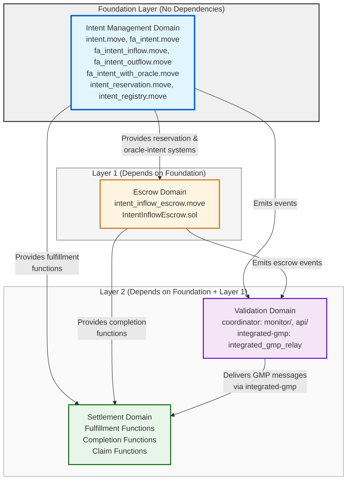
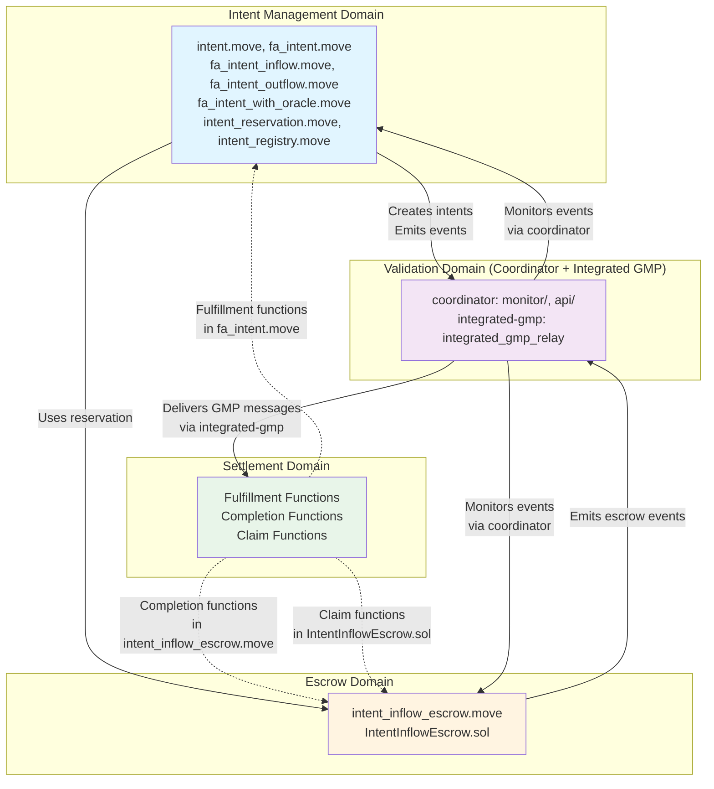

# Component-to-Domain Mapping Analysis

This document provides a comprehensive mapping of all source files in the Intent Framework to their respective domains. A domain is a logical grouping of related functionality that handles a specific set of responsibilities within the system. Domains organize the codebase into major functional areas with the following characteristics:

- Each domain has a clear purpose and responsibility
- Components (source files) belong to domains based on their functionality
- Domains interact with each other while maintaining clear boundaries
- This organization facilitates understanding of system interactions

This analysis forms the foundation for the architecture document.

## Topological Order (Build Sequence)

Following RPG methodology, domains are organized in topological order from foundation to dependent layers:

```mermaid
graph TB
    subgraph Foundation["Foundation Layer (No Dependencies)"]
        IM[Intent Management Domain<br/>intent.move, fa_intent.move<br/>fa_intent_inflow.move, fa_intent_outflow.move<br/>fa_intent_with_oracle.move<br/>intent_reservation.move, intent_registry.move]
    end

    subgraph Layer1["Layer 1 (Depends on Foundation)"]
        EM[Escrow Domain<br/>intent_inflow_escrow.move<br/>IntentInflowEscrow.sol]
    end

    subgraph Layer2["Layer 2 (Depends on Foundation + Layer 1)"]
        SM[Settlement Domain<br/>Fulfillment Functions<br/>Completion Functions<br/>Claim Functions]
        VM[Validation Domain<br/>coordinator: monitor/, api/<br/>integrated-gmp: integrated_gmp_relay]
    end

    IM -->|Provides reservation &<br/>oracle-intent systems| EM
    IM -->|Provides fulfillment<br/>functions| SM
    IM -->|Emits events| VM
    EM -->|Provides completion<br/>functions| SM
    EM -->|Emits escrow events| VM
    VM -->|Delivers GMP messages<br/>via integrated-gmp| SM

    style IM fill:#e1f5ff,stroke:#0066cc,stroke-width:3px,color:#333
    style EM fill:#fff4e1,stroke:#cc6600,stroke-width:2px,color:#333
    style SM fill:#e8f5e9,stroke:#006600,stroke-width:2px,color:#333
    style VM fill:#f3e5f5,stroke:#6600cc,stroke-width:2px,color:#333
    style Foundation fill:#f0f0f0,stroke:#333,stroke-width:2px,color:#333
    style Layer1 fill:#f5f5f5,stroke:#666,stroke-width:1px,color:#333
    style Layer2 fill:#fafafa,stroke:#999,stroke-width:1px,color:#333
```

**Build Order**:

1. **Foundation**: Intent Management (implement first - no dependencies)
2. **Layer 1**: Escrow (depends on Intent Management)
3. **Layer 2**: Settlement and Validation (Coordinator/Integrated GMP) (depend on Foundation + Layer 1)

## Domain Architecture Overview

This diagram shows all domain relationships and interactions, while the Topological Order diagram above focuses on build sequence and layering.

```mermaid
graph TB
    subgraph "Intent Management Domain"
        IM[intent.move, fa_intent.move<br/>fa_intent_inflow.move, fa_intent_outflow.move<br/>fa_intent_with_oracle.move<br/>intent_reservation.move, intent_registry.move]
    end

    subgraph "Escrow Domain"
        EM[intent_inflow_escrow.move<br/>IntentInflowEscrow.sol]
    end

    subgraph "Settlement Domain"
        SM[Fulfillment Functions<br/>Completion Functions<br/>Claim Functions]
    end

    subgraph "Validation Domain (Coordinator + Integrated GMP)"
        VM[coordinator: monitor/, api/<br/>integrated-gmp: integrated_gmp_relay]
    end

    IM -->|Creates intents<br/>Emits events| VM
    IM -->|Uses reservation| EM
    EM -->|Emits escrow events| VM
    SM -.->|Fulfillment functions<br/>in fa_intent.move| IM
    SM -.->|Completion functions<br/>in intent_inflow_escrow.move| EM
    SM -.->|Claim functions<br/>in IntentInflowEscrow.sol| EM
    VM -->|Delivers GMP messages<br/>via integrated-gmp| SM
    VM -->|Monitors events<br/>via coordinator| IM
    VM -->|Monitors events<br/>via coordinator| EM

    style IM fill:#e1f5ff,color:#333
    style EM fill:#fff4e1,color:#333
    style SM fill:#e8f5e9,color:#333
    style VM fill:#f3e5f5,color:#333
```

## Domain Definitions

### 1. Intent Management Domain

**Responsibility**: Core intent creation, validation, and lifecycle management. Handles intent types, witness systems, reservation mechanisms, and event emissions.

**Key Characteristics**:

- Manages intent lifecycle (creation, expiry, revocation)
- Enforces type-safe witness validation
- Handles intent reservation for specific solvers
- Emits events for external monitoring

### 2. Escrow Domain

**Responsibility**: Asset custody and conditional release mechanisms on connected chains. Handles fund locking on individual chains, GMP message-based validation, and escrow-specific security requirements. The cross-chain aspect comes from escrows being created on chains different from where intents are created (hub chain).

**Key Characteristics**:

- Locks assets and validates against stored IntentRequirements delivered via GMP
- Auto-releases escrowed funds upon FulfillmentProof receipt via GMP
- Enforces non-revocable requirement (CRITICAL security constraint)
- Supports both Move and EVM implementations
- Manages reserved solver addresses

### 3. Settlement Domain

**Responsibility**: Transaction completion and finalization processes across chains. Handles intent fulfillment, escrow release, and asset transfers.

**Note**: Unlike other domains, Settlement is not a separate module but rather represents completion/finalization functionality distributed across Intent Management and Escrow modules. This reflects the architectural pattern where settlement is the natural conclusion of intent/escrow operations.

**Key Characteristics**:

- Processes intent fulfillment by solvers
- Escrowed funds auto-release upon FulfillmentProof receipt via GMP
- Coordinates cross-chain asset transfers
- Handles expiry and cancellation scenarios

### 4. Validation Domain (Coordinator + Integrated GMP)

**Responsibility**: Two services that together handle event monitoring and cross-chain message delivery. The **Coordinator** handles read-only event monitoring, event caching, and negotiation routing (no private keys). The **Integrated GMP** is a pure relay service that watches `MessageSent` events on source chains and delivers messages to destination chains by calling `deliver_message` (has operator wallet keys for transaction submission). All validation is performed on-chain via GMP messages (IntentRequirements, EscrowConfirmation, FulfillmentProof).

**Key Characteristics**:

- Coordinator monitors events from multiple chains
- Integrated GMP relays GMP messages between chains (watches `MessageSent`, calls `deliver_message`)
- All cross-chain validation is on-chain via GMP message contents, not off-chain
- Coordinator provides REST API for external integration; Integrated GMP has no external API (relay only, `/health` endpoint only)

---

## Component Mapping

### Intent Management Domain

#### Core Intent Framework

- **`intent-frameworks/mvm/intent-hub/sources/intent.move`**
  - **Purpose**: Generic intent framework providing abstract structures and functions
  - **Key Structures**: `TradeIntent<Source, Args>`, `TradeSession<Args>`
  - **Key Functions**: `create_intent()`, `start_intent_session()`, `finish_intent_session()`, `revoke_intent()`
  - **Responsibilities**: Intent lifecycle, witness validation, expiry handling, revocation logic

#### Fungible Asset Intent Implementation

- **`intent-frameworks/mvm/intent-hub/sources/fa_intent.move`**
  - **Purpose**: Fungible asset trading intent implementation
  - **Key Structures**: `FALimitOrder`, `FungibleStoreManager`, `FungibleAssetRecipientWitness`
  - **Key Functions**: `create_fa_to_fa_intent()`, `start_fa_offering_session()`, `finish_fa_receiving_session_with_event()`
  - **Key Events**: `LimitOrderEvent`, `LimitOrderFulfillmentEvent`
  - **Responsibilities**: FA-specific intent creation, fulfillment logic, event emission

#### Oracle-Guarded Intent Implementation

- **`intent-frameworks/mvm/intent-hub/sources/fa_intent_with_oracle.move`**
  - **Purpose**: Oracle signature requirement layer on top of base intent mechanics
  - **Key Structures**: `OracleGuardedLimitOrder`, `OracleSignatureRequirement`
  - **Key Functions**: `create_fa_to_fa_intent_with_oracle()`, `start_oracle_intent_session()`, `finish_oracle_intent_session()`
  - **Key Events**: `OracleLimitOrderEvent`
  - **Responsibilities**: Oracle signature verification, threshold validation

#### Cross-Chain Inflow Intent

- **`intent-frameworks/mvm/intent-hub/sources/fa_intent_inflow.move`**
  - **Purpose**: Inflow cross-chain intent creation and fulfillment (tokens escrowed on connected chain, desired on hub)
  - **Key Functions**: `create_inflow_intent()`, `fulfill_inflow_intent()`
  - **Responsibilities**: Creates reserved intents with `intent_id` for cross-chain linking, zero-amount source (tokens on other chain). Uses solver registry to verify solver signatures. Gates fulfillment on escrow confirmation.

#### Cross-Chain Outflow Intent

- **`intent-frameworks/mvm/intent-hub/sources/fa_intent_outflow.move`**
  - **Purpose**: Outflow cross-chain intent creation and claim (tokens locked on hub, desired fulfillment on connected chain)
  - **Key Functions**: `create_outflow_intent()`, `fulfill_outflow_intent()`, `cancel_outflow_intent()`
  - **Responsibilities**: Creates reserved intents with tokens locked on hub. Solver fulfills on connected chain, then calls `fulfill_outflow_intent()` to collect hub tokens after FulfillmentProof receipt via GMP. Admin can cancel expired intents via `cancel_outflow_intent()`.

#### Intent Registry

- **`intent-frameworks/mvm/intent-hub/sources/intent_registry.move`**
  - **Purpose**: Tracks active intents for discovery by approvers and solvers
  - **Key Structures**: `IntentRegistry`, `IntentRecord`
  - **Key Functions**: `register_intent()`, `unregister_intent()`, `cleanup_expired()`
  - **Responsibilities**: Stores active intent IDs per requester. Only truly expired or fulfilled intents can be removed.

#### Intent Reservation System

- **`intent-frameworks/mvm/intent-hub/sources/intent_reservation.move`**
  - **Purpose**: Reserved intent system for specific solver addresses
  - **Key Structures**: `IntentReserved`, `IntentToSign`, `IntentDraft`
  - **Key Functions**: `verify_and_create_reservation()`, `verify_and_create_reservation_from_registry()`
  - **Responsibilities**: Solver reservation, signature verification for reserved intents. Supports both authentication key extraction (old format) and registry-based lookup (new format, cross-chain).

#### Solver Registry

- **`intent-frameworks/mvm/intent-hub/sources/solver_registry.move`**
  - **Purpose**: On-chain registry for solver public keys and EVM addresses
  - **Key Structures**: `SolverRegistry`, `SolverInfo`
  - **Key Functions**: `register_solver()`, `update_solver()`, `deregister_solver()`, `get_public_key()`, `get_evm_address()`
  - **Responsibilities**: Stores solver Ed25519 public keys for signature verification and EVM addresses for cross-chain escrow creation. Required for cross-chain intents and accounts with new authentication key format.

---

### Escrow Domain

#### Move-Based Escrow (Connected Chain)

- **`intent-frameworks/mvm/intent-connected/sources/gmp/intent_inflow_escrow.move`**
  - **Purpose**: Inflow escrow for MVM as connected chain with GMP integration
  - **Responsibilities**: Escrow creation with GMP requirements validation, auto-release on fulfillment proof receipt

#### EVM-Based Escrow

- **`intent-frameworks/evm/contracts/IntentInflowEscrow.sol`**
  - **Purpose**: Solidity inflow escrow contract for EVM chains
  - **Key Structures**: `StoredEscrow`, `StoredRequirements`
  - **Key Functions**: `createEscrowWithValidation()`, `cancel()`, `receiveFulfillmentProof()` (called by GMP), `getEscrow()`
  - **Key Events**: `EscrowCreated`, `EscrowReleased`, `EscrowCancelled`, `IntentRequirementsReceived`, `FulfillmentProofReceived`, `EscrowConfirmationSent`
  - **Security**: Enforces reserved solver addresses, expiry-based cancellation
  - **Responsibilities**: EVM escrow creation, fund locking, validates stored IntentRequirements via GMP, auto-releases on FulfillmentProof via GMP

#### Mock Contracts (Testing)

- **`intent-frameworks/evm/contracts/MockERC20.sol`**
  - **Purpose**: Mock ERC20 token for testing
  - **Domain**: Testing infrastructure (not part of production domains)

---

### Settlement Domain

#### Intent Fulfillment (Move)

- **`intent-frameworks/mvm/intent-hub/sources/fa_intent_inflow.move`** (inflow fulfillment)
  - **Key Functions**: `fulfill_inflow_intent()`
  - **Responsibilities**: Processes solver fulfillment for inflow intents, validates escrow confirmation, transfers assets

- **`intent-frameworks/mvm/intent-hub/sources/fa_intent_outflow.move`** (outflow claim)
  - **Key Functions**: `fulfill_outflow_intent()`
  - **Responsibilities**: Processes solver fulfillment for outflow intents after FulfillmentProof receipt via GMP

#### Escrow Release (EVM)

- **`intent-frameworks/evm/contracts/IntentInflowEscrow.sol`** (auto-release via GMP)
  - **Key Functions**: `receiveFulfillmentProof()`
  - **Responsibilities**: Auto-releases escrowed funds to solver upon FulfillmentProof delivery via GMP

#### Escrow Cancellation

- **`intent-frameworks/evm/contracts/IntentInflowEscrow.sol`** (cancel function)
  - **Key Functions**: `cancel()`
  - **Responsibilities**: Returns funds to requester after expiry

---

### Validation Domain (Coordinator + Integrated GMP)

Two services work together in this domain:

- **Coordinator** (`coordinator/src/`): Read-only event monitoring, event caching, negotiation routing. No private keys.
- **Integrated GMP** (`integrated-gmp/src/`): Pure GMP message relay. Watches `MessageSent` events on source chains and delivers messages to destination chains via `deliver_message`. Has operator wallet keys for transaction submission. All validation is on-chain via GMP message contents.

#### Event Monitoring (Coordinator)

- **`coordinator/src/monitor/`**
  - **`mod.rs`**: Main monitor module with `EventMonitor` struct, shared types, and generic monitoring logic
  - **`hub_mvm.rs`**: Move VM-specific hub chain event parsing
  - **Purpose**: Monitors hub chain events (intent creation, fulfillment)
  - **Key Structures**: `IntentEvent`, `FulfillmentEvent`, `EventMonitor`
  - **Key Functions**: `poll_hub_events()`, `monitor_hub_chain()`, `get_cached_events()`, `get_cached_fulfillment_events()`
  - **Responsibilities**:
    - Hub chain event polling
    - Event caching (intents, fulfillments)

#### GMP Message Relay (Integrated GMP)

- **`integrated-gmp/src/integrated_gmp_relay.rs`**
  - **Purpose**: Core relay logic -- watches `MessageSent` events on source chains and delivers messages to destination chains
  - **Key Structures**: `NativeGmpRelay`, `NativeGmpRelayConfig`
  - **Key Functions**: `run()` (main relay loop), polls MVM/SVM for `MessageSent` events, calls `deliver_message` on destination chains
  - **Security**: **CRITICAL** - Has operator wallet keys for transaction submission. In production, can be replaced by an external GMP provider's endpoint.
  - **Responsibilities**: GMP message delivery between chains. The relay is transparent to clients -- it only moves messages. All validation happens on-chain via message contents (IntentRequirements, EscrowConfirmation, FulfillmentProof).

#### Cryptographic Service (Integrated GMP)

- **`integrated-gmp/src/crypto/mod.rs`**
  - **Purpose**: Key management and transaction signing for the relay
  - **Key Structures**: `CryptoService`
  - **Key Functions**: `sign_evm_transaction_hash()`, `get_move_address()`, `get_ethereum_address()`, `get_solana_address()`
  - **Responsibilities**: EVM transaction signing (ECDSA), relay address derivation for all chain types (MVM, EVM, SVM)

#### REST API Servers

- **`coordinator/src/api/`** (Coordinator API - negotiation endpoints, event queries)
  - **`mod.rs`**: Main API module with route definitions, shared handlers, and `ApiServer` struct
  - **Purpose**: REST API for event queries and negotiation routing
  - **Key Endpoints**: `/health`, `/events`
  - **Key Structures**: `ApiServer`, `ApiResponse<T>`
  - **Responsibilities**: HTTP request handling, event retrieval, negotiation routing

- **Integrated GMP API**: The integrated-gmp service no longer exposes a public REST API. As a pure relay, it operates autonomously with no external API calls needed. Only a `/health` endpoint remains for operational monitoring. The previous validation/approval endpoints (`/approvals`, `/approval`, `/validate-outflow-fulfillment`, `/validate-inflow-escrow`, `/public-key`) have been removed.

#### Configuration Management

- **`coordinator/src/config/mod.rs`** (monitoring and routing configuration)
  - **Purpose**: Coordinator service configuration management
  - **Key Structures**: `Config`, `ChainConfig`, `EvmChainConfig`, `ApiConfig`
  - **Responsibilities**: Configuration loading, validation, chain-specific settings for monitoring

- **`integrated-gmp/src/config/mod.rs`** (relay and chain configuration)
  - **Purpose**: Integrated GMP relay service configuration management
  - **Key Structures**: `Config`, `ChainConfig`, `EvmChainConfig`, `IntegratedGmpConfig`
  - **Responsibilities**: Configuration loading, validation, chain-specific settings, relay operator key management

#### Chain Clients (Shared)

Both the coordinator and integrated-gmp use shared chain client crates from `chain-clients/`:

- **`chain-clients/mvm/`** — `MvmClient`: Move VM blockchain client for REST API, view functions, solver registry queries, event polling, and message delivery
- **`chain-clients/evm/`** — `EvmClient`: EVM blockchain client for JSON-RPC, `get_logs`, `get_block_number`, balance queries, and `deliver_message` transaction submission
- **`chain-clients/svm/`** — `SvmClient`: SVM blockchain client for RPC, PDA derivation, escrow parsing, balance queries, and message delivery
- **`chain-clients/common/`** — Shared utilities including `normalize_intent_id()`

The integrated-gmp also has a service-specific SVM client wrapper:

- **`integrated-gmp/src/svm_client.rs`** — Relay-specific SVM client extensions for `MessageSent` event polling and `deliver_message` transaction building

#### Core Libraries

- **`coordinator/src/lib.rs`**
  - **Purpose**: Coordinator library root, re-exports common types
  - **Responsibilities**: Module organization, public API definition

- **`integrated-gmp/src/lib.rs`**
  - **Purpose**: Integrated GMP library root, re-exports common types
  - **Responsibilities**: Module organization, public API definition

#### Main Entry Points

- **`coordinator/src/main.rs`**
  - **Purpose**: Coordinator application entry point
  - **Responsibilities**: Service initialization, event monitoring loop orchestration

- **`integrated-gmp/src/main.rs`**
  - **Purpose**: Integrated GMP application entry point
  - **Responsibilities**: Service initialization, relay loop orchestration (watches `MessageSent`, delivers messages)

#### Utility Binaries (Integrated GMP)

- **`integrated-gmp/src/bin/generate_keys.rs`**
  - **Purpose**: Key pair generation utility
  - **Domain**: Development tooling

- **`integrated-gmp/src/bin/get_approver_eth_address.rs`**
  - **Purpose**: Derive Ethereum address from Ed25519 key
  - **Domain**: Development tooling

---

## Inter-Domain Interaction Patterns and Dependencies

This section documents comprehensive communication patterns between domains, including event flows, data sharing, API calls, and error handling. Dependencies follow topological order: Foundation → Layer 1 → Layer 2.

### Event Flow Patterns

**Intent Management → Validation Domain** (Event Emission):

- `LimitOrderEvent`: Emitted when intent is created (`fa_intent.move`)
  - Contains: `intent_id`, `offered_metadata`, `offered_amount`, `desired_metadata`, `desired_amount`, `expiry_time`, `revocable`
  - Purpose: Coordinator monitors for new intents; triggers IntentRequirements GMP message to connected chain
- `LimitOrderFulfillmentEvent`: Emitted when intent is fulfilled (`fa_intent.move`)
  - Contains: `intent_id`, `solver`, `provided_metadata`, `provided_amount`, `timestamp`
  - Purpose: Triggers FulfillmentProof GMP message for escrow auto-release on connected chain
- `OracleLimitOrderEvent`: Emitted for oracle-guarded intents (`fa_intent_with_oracle.move`)
  - Contains: Same as `LimitOrderEvent` plus `min_reported_value`
  - Purpose: Used by escrow system and monitored by coordinator

**Escrow → Validation Domain** (Event Emission):

- `OracleLimitOrderEvent` (Move): Emitted when escrow is created (`intent_inflow_escrow.move`)
  - Contains: Escrow details with `intent_id` for cross-chain correlation, `reserved_solver`
  - Purpose: Coordinator monitors Move VM escrow creation
  - Monitoring: Coordinator actively polls Move VM connected chain and caches escrows when created
- `EscrowCreated` (EVM): Emitted when escrow is created (`IntentInflowEscrow.sol`)
  - Contains: `intentId`, `requester`, `token`, `reservedSolver`
  - Purpose: Coordinator monitors EVM escrow creation
  - Monitoring: Coordinator actively polls EVM connected chain and caches escrows when created (symmetrical with Move VM)
- `EscrowReleased`, `EscrowCancelled` (EVM): Emitted on escrow completion/cancellation
  - Purpose: Coordinator tracks escrow lifecycle

**Integrated GMP → Settlement** (GMP Message Delivery):

- Integrated GMP relay delivers GMP messages (IntentRequirements, EscrowConfirmation, FulfillmentProof) between chains
- Contains: Structured message payloads delivered via `deliver_message` on destination chain contracts
- Purpose: On-chain contracts validate GMP message contents and auto-release escrows upon FulfillmentProof receipt

### Functional Dependencies

**Escrow → Intent Management** (Layer 1 → Foundation):

- **Reservation System**: Escrow uses `IntentReserved` structure from `intent_reservation.move` to enforce reserved solver addresses
- **Oracle-Intent System**: Hub escrow implementation uses `fa_intent_with_oracle.move` for oracle-guarded intent mechanics
- **Function Calls**: Escrow creation on connected chains validates against IntentRequirements delivered via GMP from Intent Management

**Settlement → Intent Management** (Layer 2 → Foundation):

- **Fulfillment Functions**: Settlement calls `fulfill_inflow_intent()` from `fa_intent_inflow.move` or `fulfill_outflow_intent()` from `fa_intent_outflow.move`
- **Witness Validation**: Settlement uses witness type system from `intent.move` to validate fulfillment conditions
- **Session Management**: Settlement consumes `TradeSession` hot potato types from Intent Management

**Settlement → Escrow** (Layer 2 → Layer 1):

- **Completion Functions**: Settlement triggers escrow release via `receiveFulfillmentProof()` (EVM) or GMP-based auto-release (Move connected chain)
- **GMP-Based Release**: Escrow auto-releases upon FulfillmentProof delivery via GMP
- **Reserved Solver Enforcement**: Settlement ensures funds go to reserved solver regardless of transaction sender

**Validation Domain → Intent Management** (Layer 2 → Foundation):

- **Event Monitoring**: Coordinator polls `LimitOrderEvent` and `LimitOrderFulfillmentEvent` via blockchain RPC
- **GMP Message Relay**: Integrated GMP watches `MessageSent` events (which carry IntentRequirements, FulfillmentProof, etc.) and delivers them to destination chains; all validation of these messages happens on-chain

**Validation Domain → Escrow** (Layer 2 → Layer 1):

- **Event Monitoring**: Coordinator polls `OracleLimitOrderEvent` (Move) and `EscrowCreated` (EVM) actively
- **Symmetrical Monitoring**: Both Move VM and EVM escrows are monitored and cached when created (not retroactively)
- **GMP Message Delivery**: Integrated GMP relay delivers IntentRequirements and FulfillmentProof messages to escrow contracts on connected chains; escrow contracts validate message contents on-chain (e.g., `revocable = false` enforcement, solver address matching, chain ID matching)
- **Chain Type Detection**: Each `EscrowEvent` includes a `chain_type` field (Mvm, Evm, Svm) set by the coordinator based on which monitor discovered the event. This is trusted because it comes from the coordinator's configuration, not from untrusted event data.

### Data Flow Patterns

**Cross-Chain Correlation**:

- `intent_id` field links intents on hub chain to escrows on connected chains
- Coordinator uses `intent_id` to match events across chains via `match_events_by_intent_id()`
- Data flows: Hub Intent → `intent_id` → GMP Messages (IntentRequirements) → Connected Escrow → On-chain Validation → FulfillmentProof → Auto-release

**Reserved Solver Flow**:

- Intent Management: Provides `IntentReserved` structure with solver address
- Escrow: Stores `reserved_solver` / `reservedSolver` at creation (immutable)
- Settlement: Transfers funds to reserved solver regardless of transaction sender
- On-chain validation: Escrow contracts validate reserved solver matches via GMP-delivered IntentRequirements

**GMP Message Flow**:

- IntentRequirements: Sent from hub chain when intent is created, delivered to connected chain escrow contract for on-chain storage and validation
- EscrowConfirmation: Sent from connected chain when escrow is confirmed, delivered back to hub chain
- FulfillmentProof: Sent from hub chain when intent is fulfilled, delivered to connected chain escrow contract to trigger auto-release of escrowed funds

### API Call Patterns

**External Systems → Coordinator**:

- `GET /events`: Retrieve cached events (intents, escrows, fulfillments)

**External Systems → Integrated GMP**:

- Integrated GMP relay operates autonomously with no external API calls needed
- Only `/health` endpoint exists for operational monitoring
- The relay watches `MessageSent` events and delivers messages independently; no external system needs to invoke it

### Error Handling and Rollback Scenarios

**Intent Expiry**:

- Intent Management: Rejects fulfillment attempts after `expiry_time`
- Settlement: Cannot fulfill expired intents
- Escrow: Can be cancelled after expiry (EVM only), returns funds to requester

**GMP Message Delivery Failure**:

- Integrated GMP relay: Message delivery failure is logged and retried
- Escrow: If IntentRequirements never arrive, escrow cannot validate and remains locked until expiry
- Settlement: If FulfillmentProof never arrives, escrow auto-release does not trigger; on-chain expiry handles stuck intents

**On-Chain Validation Failure**:

- Escrow: On-chain contracts reject invalid GMP messages (e.g., mismatched `intent_id`, invalid sender)
- Escrow: Enforces `revocable = false` requirement on-chain (CRITICAL security check)
- Settlement: Cannot proceed if on-chain validation of GMP message contents fails

**Cross-Chain Correlation Failure**:

- Coordinator: Cannot match events if `intent_id` mismatch or missing
- GMP Messages: If `intent_id` in GMP message does not match on-chain escrow, on-chain validation rejects the message
- Error: Escrow remains locked until expiry if GMP messages cannot be correlated

**Reserved Solver Mismatch**:

- Escrow: Rejects completion if reserved solver doesn't match (Move: session validation, EVM: enforced in `receiveFulfillmentProof()`)
- Settlement: Funds always go to reserved solver, transaction sender irrelevant
- On-chain validation: Escrow contracts validate reserved solver via GMP-delivered IntentRequirements

---

## Domain Boundaries and Interfaces

Detailed architectural definitions of domain boundaries, external interfaces, internal components, data ownership, and interaction protocols are documented in [`domain-boundaries-and-interfaces.md`](domain-boundaries-and-interfaces.md). This document follows RPG methodology principles and serves as architectural guidance for development decisions.

---

## Domain Boundaries Summary

This table provides a concise overview of domain boundaries, listing the primary source files for each domain and their core responsibilities. It serves as a quick reference for understanding which components belong to which domain and what each domain's primary function is within the Intent Framework system.

| Domain | Primary Files | Key Responsibility |
|--------|--------------|-------------------|
| **Intent Management** | `intent.move`, `fa_intent.move`, `fa_intent_inflow.move`, `fa_intent_outflow.move`, `fa_intent_with_oracle.move`, `intent_reservation.move`, `intent_registry.move`, `solver_registry.move` | Intent lifecycle, creation, validation, event emission |
| **Escrow** | `intent_inflow_escrow.move` (connected chain), `IntentInflowEscrow.sol` | Asset custody, fund locking, GMP message-based validation and auto-release |
| **Settlement** | Functions in `fa_intent_inflow.move`, `fa_intent_outflow.move`, `IntentInflowEscrow.sol` | Intent fulfillment, escrow completion, asset transfers |
| **Validation (Coordinator + Integrated GMP)** | Coordinator: `monitor/`, `api/`, `config/`, `storage/`; Integrated GMP: `integrated_gmp_relay.rs`, `config/`, `svm_client.rs`; Shared: `chain-clients/{mvm,evm,svm,common}/` | Coordinator: event monitoring (hub, MVM, EVM, SVM), caching, negotiation routing; Integrated GMP: GMP message relay (watches `MessageSent`, delivers messages to destination chains) |
