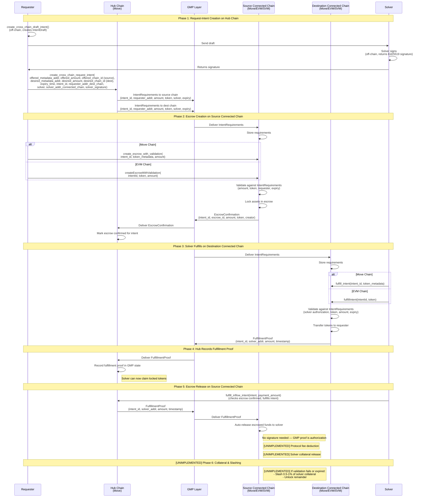

# Architecture Differences

This document highlights the differences between the conception documents and the current implementation. It describes what has been implemented, what differs from the conceptual design, and what is planned for the future.

For the conceptual design and flow diagrams, see:

- [conception_generic.md](conception_generic.md) - General concepts, actors, and generic protocol steps
- [conception_inflow.md](conception_inflow.md) - Inflow flow (Connected Chain → Hub)
- [conception_outflow.md](conception_outflow.md) - Outflow flow (Hub → Connected Chain)
- [conception_routerflow.md](conception_routerflow.md) - Router flow (Connected Chain → Connected Chain)

For detailed architectural principles and design philosophy, see the [Architecture Documentation](../README.md):

- **[RPG Methodology Principles](../rpg-methodology.md)** - Design philosophy and domain-based organization principles
- **[Component-to-Domain Mapping](../architecture-component-mapping.md)** - How components are organized into domains and inter-domain interaction patterns
- **[Domain Boundaries and Interfaces](../domain-boundaries-and-interfaces.md)** - Precise domain boundary definitions and interface specifications

## Implementation Status

### Inflow (Connected Chain → Hub)

See [conception_inflow.md](conception_inflow.md) for the conceptual design.

**Implemented Functions:**

| Step | Function | Description |
|------|----------|-------------|
| Request-Intent Creation | `create_inflow_intent(offered_metadata_addr, offered_amount, offered_chain_id, desired_metadata, desired_amount, desired_chain_id, expiry_time, intent_id, solver, solver_addr_connected_chain, solver_signature, requester_addr_connected_chain)` | Creates reserved intent on Hub and sends IntentRequirements to connected chain via GMP |
| GMP Requirements Delivery | `receive_intent_requirements(src_chain_id, remote_gmp_endpoint_addr, payload)` | Connected chain receives and stores IntentRequirements from hub via GMP |
| Escrow (Move) | `create_escrow_with_validation(intent_id, token_metadata, amount)` | Creates escrow on Move connected chain; validates against GMP-delivered IntentRequirements (amount, token, requester, expiry) |
| Escrow (EVM) | `createEscrowWithValidation(intentId, token, amount)` | Creates escrow on EVM connected chain; validates against stored IntentRequirements |
| EscrowConfirmation | Sent automatically on escrow creation | Connected chain sends EscrowConfirmation back to hub via GMP after validated escrow creation |
| Fulfillment | `fulfill_inflow_intent(intent, payment_amount)` | Solver fulfills intent on Hub (requires escrow confirmation); sends FulfillmentProof to connected chain via GMP |
| Escrow Release | Auto-releases on FulfillmentProof receipt via GMP | Connected chain receives FulfillmentProof from hub and automatically transfers escrowed funds to solver (no signature needed) |

**GMP Message Types (Inflow):**

| Message | Direction | Purpose |
|---------|-----------|---------|
| `IntentRequirements` (0x01) | Hub -> Connected Chain | Delivers requirements (amount, token, solver, expiry) for escrow validation |
| `EscrowConfirmation` (0x02) | Connected Chain -> Hub | Confirms escrow was created matching requirements; gates solver fulfillment on hub |
| `FulfillmentProof` (0x03) | Hub -> Connected Chain | Proves solver fulfilled on hub; triggers automatic escrow release to solver |

**Events:**

- `LimitOrderEvent` - Emitted on request-intent creation (hub)
- `IntentRequirementsReceived` - Emitted when connected chain receives requirements from hub
- `EscrowCreated` / `EscrowConfirmationSent` - Emitted on escrow creation and confirmation (connected chain)
- `EscrowConfirmationReceived` - Emitted when hub receives escrow confirmation
- `LimitOrderFulfillmentEvent` - Emitted on fulfillment (hub)
- `FulfillmentProofSent` / `FulfillmentProofReceived` - Emitted on fulfillment proof send/receive
- `EscrowReleased` - Emitted when escrowed funds are transferred to solver (connected chain)

**[UNIMPLEMENTED] Features:**

- Protocol fee deduction
- Solver collateral release
- Collateral slashing (0.5-1%) on validation failure or expiry

### Outflow (Hub → Connected Chain)

See [conception_outflow.md](conception_outflow.md) for the conceptual design.

**Implemented Functions:**

| Step | Function | Description |
|------|----------|-------------|
| Request-Intent Creation | `create_outflow_intent(offered_metadata, offered_amount, offered_chain_id, desired_metadata_addr, desired_amount, desired_chain_id, expiry_time, intent_id, requester_addr_connected_chain, solver, solver_addr_connected_chain, solver_signature)` | Creates reserved intent with escrow on Hub; sends IntentRequirements to connected chain via GMP |
| GMP Requirements Delivery | `receive_intent_requirements(src_chain_id, remote_gmp_endpoint_addr, payload)` | Connected chain receives and stores IntentRequirements from hub via GMP |
| Fulfillment (Move) | `fulfill_intent(solver, intent_id, token_metadata)` | Solver calls validation contract on Move connected chain; validates against requirements, transfers tokens to requester, sends FulfillmentProof to hub via GMP |
| Fulfillment (EVM) | `fulfillIntent(intentId, token)` | Solver calls validation contract on EVM connected chain; validates against requirements, transfers tokens to requester, sends FulfillmentProof to hub via GMP |
| Hub Escrow Release | `fulfill_outflow_intent(solver, intent)` | Solver claims locked tokens on hub after FulfillmentProof is received via GMP (no signature needed) |

**GMP Message Types (Outflow):**

| Message | Direction | Purpose |
|---------|-----------|---------|
| `IntentRequirements` (0x01) | Hub -> Connected Chain | Delivers requirements (amount, token, solver, expiry) for fulfillment validation |
| `FulfillmentProof` (0x03) | Connected Chain -> Hub | Proves solver fulfilled on connected chain; enables solver to claim locked tokens on hub |

**Events:**

- `OracleLimitOrderEvent` - Emitted on request-intent creation (hub)
- `IntentRequirementsReceived` - Emitted when connected chain receives requirements from hub
- `FulfillmentSucceeded` / `FulfillmentProofSent` - Emitted on validated fulfillment (connected chain)
- `FulfillmentProofReceived` - Emitted when hub receives proof from connected chain
- `LimitOrderFulfillmentEvent` - Emitted when solver claims locked tokens (hub)

**[UNIMPLEMENTED] Features:**

- Solver claims intent and locks collateral (lock_ratio ~ 10-20%)
- Protocol fee deduction
- Collateral penalty (0.5-1%) on validation failure or expiry

### Router Flow (Connected Chain → Connected Chain) - Not Yet Implemented

See [conception_routerflow.md](conception_routerflow.md) for the conceptual design.

**Status:** The entire Router Flow is not yet implemented. See the [Appendix](#appendix-router-flow-not-yet-implemented) for the planned implementation details.

## Future Enhancements (All Flows)

- **Protocol Fees**: Automatic fee deduction from escrow/hub transfers to solver
- **Solver Collateral**: Solvers lock collateral that can be slashed (0.5-1%) if validation fails or intent expires

---

## Appendix: Router Flow (Not Yet Implemented)

This section contains the detailed implementation diagram for the Router Flow, which is not yet implemented.

**Implementation Details**: This flow combines elements of both inflow and outflow:

- **Hub request-intent**: Creates a cross-chain intent on the hub chain and sends IntentRequirements to both source and destination connected chains via GMP
- **Source connected chain escrow**: Like inflow, tokens are locked in escrow on the source connected chain after validating against GMP-delivered IntentRequirements; EscrowConfirmation is sent back to hub
- **Destination connected chain fulfillment**: Like outflow, solver calls the on-chain validation contract on the destination connected chain, which validates, transfers tokens to the requester, and sends FulfillmentProof to hub
- **Escrow release**: When the hub receives the FulfillmentProof from the destination chain, the solver can trigger fulfillment on the hub, which sends a FulfillmentProof to the source chain to auto-release escrowed funds
