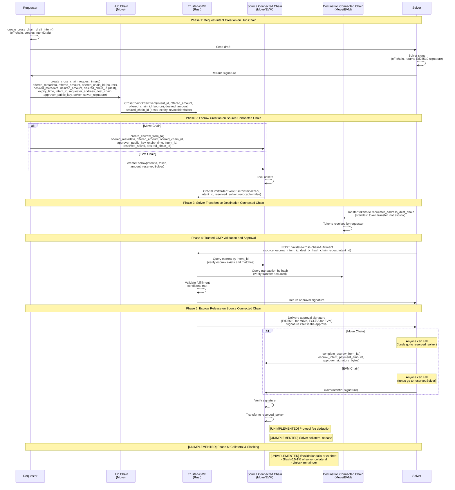

# Architecture Differences

This document highlights the differences between the conception documents and the current implementation. It describes what has been implemented, what differs from the conceptual design, and what is planned for the future.

For the conceptual design and flow diagrams, see:

- [conception_generic.md](conception_generic.md) - General concepts, actors, and generic protocol steps
- [conception_inflow.md](conception_inflow.md) - Inflow flow (Connected Chain → Hub)
- [conception_outflow.md](conception_outflow.md) - Outflow flow (Hub → Connected Chain)
- [conception_routerflow.md](conception_routerflow.md) - Router flow (Connected Chain → Connected Chain)

For detailed architectural principles and design philosophy, see the [Architecture Documentation](../README.md):

- **[RPG Methodology Principles](../rpg-methodology.md)** - Design philosophy and domain-based organization principles
- **[Component-to-Domain Mapping](../architecture-component-mapping.md)** - How components are organized into domains and inter-domain interaction patterns
- **[Domain Boundaries and Interfaces](../domain-boundaries-and-interfaces.md)** - Precise domain boundary definitions and interface specifications

## Implementation Status

### Inflow (Connected Chain → Hub)

See [conception_inflow.md](conception_inflow.md) for the conceptual design.

**Implemented Functions:**

| Step | Function | Description |
|------|----------|-------------|
| Request-Intent Creation | `create_inflow_request_intent(offered_metadata, offered_amount, offered_chain_id, desired_metadata, desired_amount, desired_chain_id, expiry_time, intent_id, solver, solver_signature)` | Creates reserved intent on Hub |
| Escrow (Move) | `create_escrow_from_fa(offered_metadata, offered_amount, offered_chain_id, approver_public_key, expiry_time, intent_id, reserved_solver, desired_chain_id)` | Creates escrow on Move connected chain |
| Escrow (EVM) | `createEscrow(intentId, token, amount, reservedSolver)` | Creates escrow on EVM connected chain |
| Fulfillment | `fulfill_inflow_request_intent(intent, payment_amount)` | Solver fulfills intent on Hub |
| Escrow Release (Move) | `complete_escrow_from_fa(escrow_intent, payment_amount, approver_signature_bytes)` | Releases escrow on Move chain |
| Escrow Release (EVM) | `claim(intentId, signature)` | Releases escrow on EVM chain |

**Events:**

- `LimitOrderEvent` - Emitted on request-intent creation
- `OracleLimitOrderEvent` / `EscrowInitialized` - Emitted on escrow creation
- `LimitOrderFulfillmentEvent` - Emitted on fulfillment

**[UNIMPLEMENTED] Features:**

- Multi-RPC quorum validation (≥2 matching receipts)
- Protocol fee deduction
- Solver collateral release
- Collateral slashing (0.5-1%) on validation failure or expiry

### Outflow (Hub → Connected Chain)

See [conception_outflow.md](conception_outflow.md) for the conceptual design.

**Implemented Functions:**

| Step | Function | Description |
|------|----------|-------------|
| Request-Intent Creation | `create_outflow_request_intent(offered_metadata, offered_amount, offered_chain_id, desired_metadata, desired_amount, desired_chain_id, expiry_time, intent_id, requester_addr_connected_chain, approver_public_key, solver, solver_signature)` | Creates reserved intent with escrow on Hub |
| Validation | `POST /validate-outflow-fulfillment(transaction_hash, chain_type, intent_id)` | Trusted-gmp validates solver transfer |
| Fulfillment | `fulfill_outflow_request_intent(intent, approver_signature_bytes)` | Solver claims escrow on Hub with trusted-gmp signature |

**Events:**

- `OracleLimitOrderEvent` - Emitted on request-intent creation

**[UNIMPLEMENTED] Features:**

- Solver claims intent and locks collateral (lock_ratio ≈ 10-20%)
- Protocol fee deduction
- Collateral penalty (0.5-1%) on validation failure or expiry

### Router Flow (Connected Chain → Connected Chain) - Not Yet Implemented

See [conception_routerflow.md](conception_routerflow.md) for the conceptual design.

**Status:** The entire Router Flow is not yet implemented. See the [Appendix](#appendix-router-flow-not-yet-implemented) for the planned implementation details.

## Future Enhancements (All Flows)

- **Multi-RPC Quorum**: Trusted-gmp uses multiple RPC endpoints with quorum validation (≥2 matching receipts) for enhanced security
- **Protocol Fees**: Automatic fee deduction from escrow/hub transfers to solver
- **Solver Collateral**: Solvers lock collateral that can be slashed (0.5-1%) if validation fails or intent expires
- **Bypass/Trusted-gmp-gated Modes**: Alternative flow modes where trusted-gmp (or coordinator) commits transactions on behalf of users

---

## Appendix: Router Flow (Not Yet Implemented)

This section contains the detailed implementation diagram for the Router Flow, which is not yet implemented.

**Implementation Details**: This flow combines elements of both inflow and outflow:

- **Hub request-intent**: Similar to both inflow and outflow, creates a cross-chain intent on the hub chain
- **Source connected chain escrow-intent**: Like inflow, tokens are locked in escrow on the source connected chain
- **Destination connected chain fulfill transaction**: Like outflow, solver transfers tokens directly on the destination connected chain
