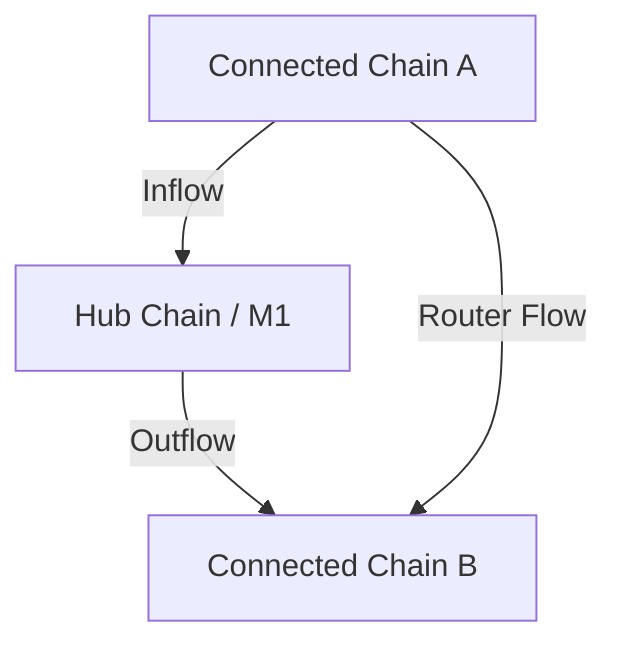

# Conception

This document provides an overview of the Intent Framework conception, covering the fundamental concepts, actors, and flows.

## Introduction

The Intent Framework is a system for creating programmable intents. It enables users to create time-bound, conditional offers that can be executed by third parties (solvers) when specific conditions are met. The framework provides a generic system for creating intents with built-in expiry, witness validation, and owner revocation capabilities, enabling use cases beyond trading such as conditional payments, escrow mechanisms, and cross-chain coordination.

The system consists of several components:

- **Move Intent Framework**: A set of Move smart contracts that implement the core intent creation, management, and execution logic on Move-based chains. The framework supports multiple intent types including unreserved intents (executable by any solver), reserved intents (pre-authorized solvers), and oracle-guarded intents (conditional on external data validation).

- **EVM Intent Framework**: A set of Solidity smart contracts that implement escrow functionality for EVM-based connected chains, enabling cross-chain intents with EVM chains.

- **Coordinator**: A Rust service for event monitoring and negotiation routing (draft intents, no private keys).
- **Integrated-GMP**: A Rust service that validates fulfillment conditions across connected chains and provides cryptographic approvals for intent and escrow completion in cross-chain scenarios.

- **Solver Tools**: Tools and libraries for solver signature generation and transaction templates, enabling solvers to participate in the intent system.

The framework can also function as an escrow mechanism, allowing funds to be locked and released based on verified conditions. This makes it suitable for applications requiring conditional payments, cross-chain trades, and other scenarios where execution depends on external state verification.

## Chains

- **M1 chain**: The Movement L1 chain, also referred to as the Hub chain. This is the central chain where request-intents are created and fulfilled.
- **Connected chain**: Any chain connected to the M1 chain (e.g., EVM chains, other Move VM chains). Tokens are locked in escrow on connected chains for cross-chain intents.

## Actors

- Requester: the requester that wants to swap some USDhub/USDcon from one chain to another using the intent process.
- Solver: actor that solves the swap intent. Can be anyone in a permissionless setting.
- Movement (Mvmt): Represents the Movement corporation that operates the intent application. Depending on the protocol but it can be a trusted entity if it runs some part of the protocol (e.g. coordinator and integrated-gmp services).
- Adversary: a malicious actor that wants to steal some funds or disturb the system.

## Flow Types

The Intent Framework supports three types of cross-chain flows:

1. **Inflow** (Connected Chain → Hub): Tokens are locked in escrow on a connected chain and desired on the M1 chain. See [conception_inflow.md](conception_inflow.md) for details.

2. **Outflow** (Hub → Connected Chain): Tokens are locked on the M1 chain and desired on a connected chain. See [conception_outflow.md](conception_outflow.md) for details.

3. **Router Flow** (Connected Chain → Connected Chain): Tokens are locked on a source connected chain and desired on a destination connected chain, with the hub coordinating. See [conception_routerflow.md](conception_routerflow.md) for details.

The router flow is conceptually a combination of inflow and outflow, where the Hub chain coordinates the swap without holding the tokens.

## Generic Protocol Steps

The following steps are common to all flows (inflow, outflow, router flow). Flow-specific steps follow these generic steps in the respective conception documents.

### 1) Requester initiates draft request-intent and forwards to solver

The requester creates a draft request-intent with the desired swap parameters and forwards it to a solver for off-chain negotiation.

#### Draft Intent Data

The draft request-intent contains the following data:

- **requester public keys for both chains**: identifies the requester on both chains. There's always a M1 chain key in it.
- **offered_metadata**: metadata of the token type being offered.
- **offered amount**: amount of token to transfer on source chain by the requester.
- **offered_chain_id**: chain ID where the escrow is created (source chain).
- **desired_metadata**: metadata of the desired token type.
- **desired amount**: amount of token to transfer on destination chain by the solver.
- **desired_chain_id**: chain ID where the desired tokens are located (destination chain).
- **fee**: fee of the transfer.
- **expiry_time**: timestamp where the intent will expire. Set by the requester.

### 2) Solver reviews and signs draft request-intent

The solver reviews the draft request-intent and signs it off-chain, returning the signature to the requester. This signature commits the solver to fulfill the request-intent if it is created on-chain.

### 3) Requester initiates request-intent

Requester creates the request-intent on-chain. The request-intent contains the draft (from step 1) plus the solver's signature (from step 2).

The `intent_id` is generated at this point as a hash of the draft, timestamp, and solver signature. The intent status is set to Reserved when created (since the solver has already signed the draft).

The contract verifies that the solver has enough free collateral on Hub chain to fulfill the intent. The request-intent is rejected if the solver does not have enough collateral.

Generally the status can be: Reserved, Filled, Cancelled, but at this point it is Reserved.

Save the intent data in a table with the `intent_id` as key.

## Use cases

We list generic use cases applicable to all flows. For flow-specific use cases, see the respective conception documents.

### Users (Requester)

- As a requester, I want a secure process so that I don't lose any tokens.

### Solver

- As a solver, I want to gain some tokens by participating in the intent system so that it exceeds my operational cost.
- As a solver, I want a reliable solver process so that I don't have to spend time operating my servers.
- As a solver, I want to be able to evaluate the benefit of taking an intent so that I don't solve intents that make me lose money.

### Movement (Mvmt)

- As Movement I want to have a reliable and secure application so that Solver and requester feel confident to use it.
- As Movement I want that Requester use Move so that it increases the overall M1 chain usage.
- As Movement I want to propose an open process where anybody can join so that it can grow without costing more to me.

### Adversary

- As an adversary I want to steal some funds from the application to earn more money
- As an adversary I want to disturb the process so that it affects its reputation.

## Security Properties

### Non-Revocable Escrows

All escrow intents MUST have `revocable = false`. This is a critical security requirement.

**Rationale:** Escrow funds must remain locked until integrated-gmp approval or expiry. If escrows were revocable, users could withdraw funds after integrated-gmp triggers actions elsewhere (e.g., after solver has already fulfilled on another chain), breaking protocol security guarantees.

### Reserved Solver Enforcement

Funds always transfer to the reserved solver regardless of who submits the transaction.

**Rationale:** Prevents unauthorized fund recipients and signature replay attacks. Ensures funds go to the solver who committed resources on other chains, not to whoever happens to call the release function.

### Concurrent Fulfillment Prevention

Only one solver can fulfill an intent, even if multiple solvers attempt simultaneously.

**Rationale:** The intent is consumed during fulfillment (session-based pattern). Once a solver starts the fulfillment session, the intent is locked and other solvers cannot access it. This prevents race conditions and double-fulfillment.

## Error Cases

- **Draft signature mismatch**: Request-intent creation fails if the solver signature does not match the draft fields.
- **Insufficient solver collateral**: Request-intent creation aborts if the solver does not meet collateral requirements on the hub chain.
- **Intent expiry reached**: Fulfillment or escrow release is rejected after `expiry_time`.
- **Invalid witness / proof**: Wrong witness type or proof format is provided for the flow; the fulfillment or validation call aborts.
- **Integrated-gmp relay unavailable or lagging**: GMP message delivery is delayed; escrow release must wait until the relay delivers the FulfillmentProof. On-chain expiry handles stuck intents.
- **Chain mismatch or metadata mismatch**: Offered/desired token metadata or chain ID does not match the intent; validation rejects the action.

## Risks

### Stolen funds risk

- the escrow account can be hacked.
- the final transfer step can be hacked and do false transfers.

### Disturb the service

- DOS attack on server (Solver or Integrated-gmp) or one of the blockchain.
- Create too many false intents.
