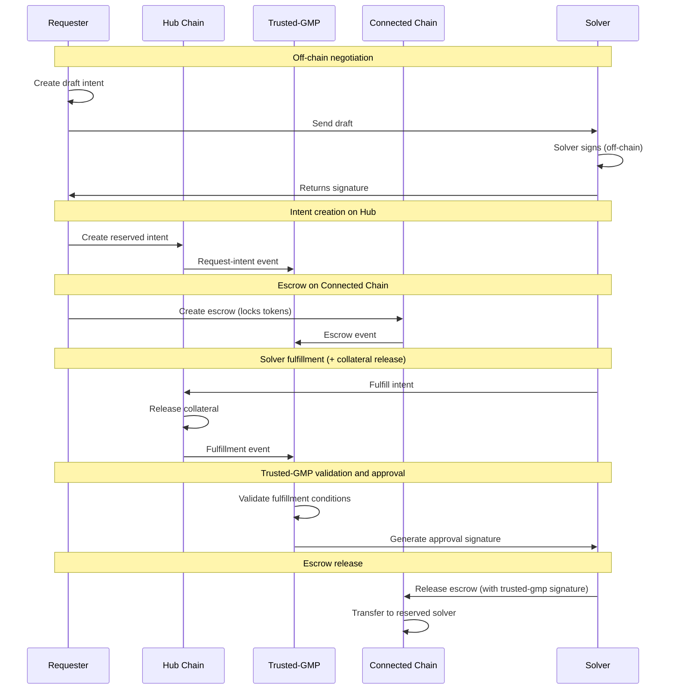

# Conception - Inflow Flow

This document describes the Inflow flow (Connected Chain → Hub). For general concepts, actors, and terminology, see [conception_generic.md](conception_generic.md).

## Use cases

For general use cases applicable to all flows, see [conception_generic.md](conception_generic.md). This section focuses on inflow-specific use cases.

### Users (Requester)

- As a requester, I want to swap some USDcon from a connected chain to M1 chain so that I get my USDhub on M1 chain fast and with low fee.

## Protocol

## Scenarios

### Requester makes an inflow swap intent

0. Given the requester
   - owns the USDcon that they want to transfer
   - owns some MOVE to execute Tx on M1 chain
   - owns offered tokens on connected chain
   - can access the connected chain and M1 chain RPC

1. When the requester wants to realize a swap from connected chain to M1 chain
   - then the requester requests a signed quote from a solver for the desired intent
   - then the requester sends a request-intent Tx to the M1 chain. ( 2) Requester initiates intent protocol step)
   - then the requester sends a Tx to connected chain to transfer the needed USDcon + total fees token to an escrow. ( 1) Requester deposit protocol step)
   - then the requester waits for a confirmation of the swap
   - then the requester has received the requested amount of USDhub in their M1 chain account.

#### Possible issues (Requester)

1. The requester initial escrow transfer is too little or too much.
    - _Mitigation: Trusted-gmp verifies that the escrow transfer amount is the same as the request-intent offered amount._
1. The requester didn't get the right expected amount of USDhub.
    - _Mitigation: Trusted-gmp verifies that the escrow transfer amount is the same as the request-intent amount._
1. The escrow deposit on the connected chain fails. How can the requester withdraw their tokens?
    - _Mitigation: The escrow eventually times out and the requester can withdraw their tokens._
1. The requester reuses a Tx already attached to another intent.
    - _Mitigation: The escrow contains the `intent_id`, ensuring each escrow is linked to a unique intent._

#### Questions

- Are the fees in USDcon or in the chain token?

### Solver resolves an inflow swap intent

0. Given the solver
   - is registered in the solver registry on Hub chain
   - owns some MOVE to execute Tx on M1 chain
   - owns enough USDhub on M1 chain
   - can access both chains' RPC
1. When the requester creates a draft intent and sends it to the solver
   - Then the solver signs the draft intent off-chain and returns signature
2. When the requester creates the reserved request-intent on Hub chain
   - Then the solver observes the request-intent and escrow events
   - Then the solver fulfills the request-intent on Hub chain (transfers desired tokens to requester)
   - Then the solver waits for trusted-gmp validation and approval
   - Then the solver claims the escrow funds on the connected chain

#### Possible issues (Solver)

- The solver doesn't send the right amount of desired tokens to the requester on Hub chain.
  - _Mitigation: The solver submits the amount to the request-intent. The intent reverts if the amount is not the same as the request-intent requested amount._
- The solver doesn't receive the correct amount from escrow on connected chain.
  - _Mitigation: The solver verifies that the escrow transfer amount is the same as the request-intent offered amount._
  - _Mitigation: Trusted-gmp verifies that the escrow offered amount is the same as the request-intent offered amount and informs the solver._
- The solver is not notified of new intent request events.
  - _Mitigation: Coordinator receives draft intents from the requester and solvers poll for drafts; trusted-gmp receives intent events for validation._
- The solver attempts to fulfill an intent that wasn't reserved for them (on-chain verification prevents this).
  - _Mitigation: The contract rejects the fulfillment if the intent is not reserved for the solver._
- The solver provides the wrong token type on Hub chain.
  - _Mitigation: The contract verifies that the token metadata matches the desired_metadata. The fulfillment transaction aborts if the token type is incorrect._
- The trusted-gmp signature verification fails during escrow release.
  - _Mitigation: The escrow contract verifies the trusted-gmp (approver) signature. If verification fails, the release transaction aborts and funds remain locked until a valid signature is provided or the escrow expires._

### The requeserter is adverse

0. Given the adversary takes the requester role to do a swap
1. When the adversary wants to extract more funds than the adversary has provided
   - Then the adversary sends a request-intent Tx to the M1 chain.
   - Then the adversary sends a Tx to the connected chain that transfers too little USDcon token to an escrow.
   - Then the adversary hopes to get more USDhub on the M1 chain than they have provided.
      - _Mitigation: The solver verifies that the correct offered amount (USDcon requested amount + fee) has been transferred to the escrow._
      - _Mitigation: Trusted-gmp verifies that the escrow transfer amount is the same as the request-intent offered amount._
2. When the adversary attempts to stall the request-intent holding solver funds hostage.
   - Then the adversary reserves the intent
   - Then the adversary takes no action
      - _Mitigation: The request-intent is protected by a timeout mechanism. After timeout, the intent is cancelled and the solver has no obligation to fulfill the intent any longer._

### The solver is adverse

0. Given the adversary takes the solver role to resolve an intent
1. When the adversary attempts to transfer less then the desired amount
   - Then the adversary reserves the intent
   - (Optional) Then the adversary transfers less funds than expected to the requester account.
   - Then the adversary hopes that the intent is fulfilled and the offered amount is transferred to the adversary account on the connected chain.
      - _Mitigation: The smart contract rejects the fulfillment if the amount is less than the request-intent desired amount._
2. When the adversary attemtps to stall the request-intent.
   - Then the adversary reserves the intent
   - Then the adversary takes no action
      - _Mitigation: The request-intent and the escrow is protected by a timeout mechanism. After timeout, the intent and escrow are cancelled and the funds are returned to the requester._

## Error Cases

- **Escrow not created or incorrect**: Connected-chain escrow missing, wrong amount, wrong mint, or wrong reserved solver; trusted-gmp rejects.
- **Hub fulfillment mismatch**: Solver fulfills intent with incorrect amount or metadata; hub transaction aborts and no fulfillment event is emitted.
- **Invalid approval signature**: Escrow release fails if trusted-gmp signature or intent ID mismatch.
- **Expiry reached**: Escrow cannot be released after expiry; requester can cancel and reclaim.
- **Monitoring gaps**: Trusted-gmp does not observe escrow or fulfillment events in time; approval is delayed until events are observed.

## Protocol steps details

Steps 1-3 are generic to all flows. See [conception_generic.md](conception_generic.md#generic-protocol-steps) for details.

### 4) Requester deposit

Requester deposits on the connected chain the offered amount + fee token to an escrow contract. Deposit needs to be tracked by trusted-gmp.
The requester calls the smart contract with the amount of token to swap + the pre-calculated fee.
The contract:

- verify the fee amount
- transfer the amount + fee token to the escrow pool
- use the `intent_id` (from step 3) to associate the escrow with the intent
- save the association with the `intent_id` and the swap amount in a table.

The `intent_id` allows to associate the request-intent with a transfer/escrow on the connected chains to verify that the requester has provided the escrow.

### 5) Solver detects and verifies escrow

The solver monitors escrow events on the connected chain to detect when the requester has deposited funds. The solver verifies that the requester has transferred the correct funds to the escrow and that the intent's data are consistent.

Alternatively, trusted-gmp monitors the escrow events and the solver can query trusted-gmp.

### 6) Solver fulfills intent on Hub chain

The solver fulfills the intent on Hub chain by transferring the desired amount and fulfilling the request-intent. The transfer and intent fulfillment are done on-chain using a specific function that links the transfer to the intent.

### 7) Solver submits intent-filled

The solver submits to trusted-gmp an intent-filled request. This request contains the intent id and the proof of the transfer to the requester.
The Solver submits its account on the connected chain to be able to transfer the funds.

Remarks:
The notification can be done on-chain using the same contract's call as the deposit (Step 6, in this case, the deposit generates an event monitored by trusted-gmp) or call trusted-gmp via a REST entry point.
I'm more in favor of the first behavior (on-chain notification) because it's easier to manage scenarios where notifications are missed. For example, if trusted-gmp is down, the solver needs to manage to resend the filled request, and this logic can be very error-prone (miss notification error, send several time the same notification, ...).

Current implementation uses on-chain events for trusted-gmp monitoring on both hub and connected chains. REST notification is not used in the SVM/MVM/EVM flows.

### 8) Trusted-gmp verifies the execution of all legs and signs

Trusted-gmp verifies the correct execution of all legs:

1. **Escrow verification** (connected chain): Trusted-gmp verifies that the requester has deposited the correct offered amount + fee to the escrow on the connected chain, linked to the correct `intent_id`.

2. **Fulfillment verification** (Hub chain): Trusted-gmp observes the successful fulfillment event emission. The contract itself verifies the correct token type, amount, and authorized solver - if any check fails, the transaction aborts and no event is emitted.

After successful verification, trusted-gmp signs an approval for escrow release.

### 9) Escrow release

Trusted-gmp or the solver (with trusted-gmp signature) releases the escrow. The offered amount + solver fee is transferred to the solver account.

Deducts fixed protocol fee → Treasury.

### 10) Trusted-gmp closes the intent

Trusted-gmp updates the intent status to closed.
Updates exposure metrics.

Steps 9 and 10 are done in the same M1 chain call.
