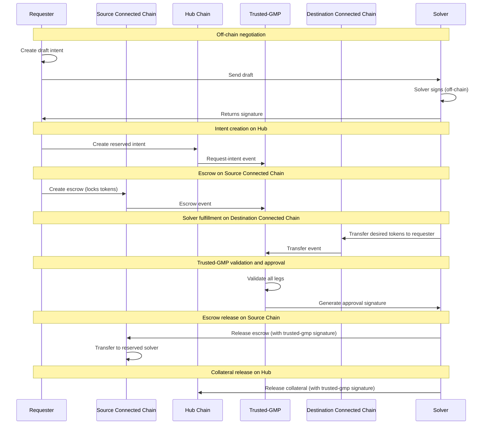

# Conception - Router Flow

This document describes the Router Flow (Connected Chain → Connected Chain). For general concepts, actors, and terminology, see [conception_generic.md](conception_generic.md).

## Use cases

For general use cases applicable to all flows, see [conception_generic.md](conception_generic.md). This section focuses on router-flow-specific use cases.

### Users (Requester)

- As a requester, I want to swap some USDcon from one connected chain to another connected chain so that I get my USDcon on the destination chain fast and with low fee.

## Protocol

## Scenarios

### Requester makes a router-flow swap intent

0. Given the requester
   - owns the USDcon that they want to transfer on source connected chain
   - owns some MOVE to execute Tx on M1 chain
   - can access both connected chains and M1 chain RPC

1. When the requester wants to realize a swap from source connected chain to destination connected chain
   - then the requester requests a signed quote from a solver for the intent
   - then the requester sends a request-intent Tx to the M1 chain
   - then the requester sends a Tx to source connected chain to transfer the needed USDcon + total fees to an escrow
   - then the requester waits for a confirmation of the swap
   - then the requester has received the requested amount of USDcon in their destination connected chain account.

#### Possible issues (Requester)

1. The requester initial escrow transfer is too little or too much.
    - _Mitigation: The solver verifies that the escrow transfer amount is the same as the request-intent offered amount before transferring the funds on the destination connected chain. Alternatively, the solver queries trusted-gmp which verifies that the escrow transfer amount is the same as the request-intent offered amount and informs the solver._
2. The requester didn't get the right expected amount of USDcon on the destination connected chain.
    - _Mitigation: Trusted-gmp verifies that the transfer amount on the destination connected chain matches the request-intent desired amount. Only if the amount is correct, trusted-gmp signs the approval for escrow release._
3. The escrow deposit on the source connected chain fails. How can the requester withdraw their tokens?
    - _Mitigation: The escrow eventually times out and the requester can withdraw their tokens._
4. The requester reuses a Tx already attached to another intent.
    - _Mitigation: The escrow contains the `intent_id`, ensuring each escrow is linked to a unique intent._

### Solver resolves a router-flow swap intent

0. Given the solver
   - is registered in the solver registry on Hub chain
   - owns enough USDcon on the destination connected chain
   - can access all chains' RPC

1. When the requester creates a draft intent and sends it to the solver
   - Then the solver signs the draft intent off-chain and returns signature

2. When the requester creates the reserved request-intent on Hub chain
   - Then the solver observes the request-intent event
   - Then the solver observes the escrow event on source connected chain
   - Then the solver transfers the desired tokens to the requester on the destination connected chain
   - Then the solver waits for trusted-gmp validation and approval
   - Then the solver claims the escrow funds on the source connected chain

#### Possible issues (Solver)

- The solver doesn't send the right amount of desired tokens to the requester on destination chain.
  - _Mitigation: Trusted-gmp verifies that the transfer amount matches the request-intent desired amount before signing approval._
- The solver doesn't receive the correct amount from escrow on source connected chain.
  - _Mitigation: The solver verifies that the escrow transfer amount is the same as the request-intent offered amount before transferring the funds on the destination connected chain._
  - _Mitigation: Trusted-gmp verifies that the escrow offered amount is the same as the request-intent offered amount and informs the solver._
- The solver is not notified of new request-intent events.
  - _Mitigation: Trusted-gmp (and coordinator) receive intent-requests from the contract and can be queried by the solver._
- The solver attempts to fulfill an intent that wasn't reserved for them.
  - _Mitigation: Trusted-gmp only signs approval for the reserved solver._
- The solver provides the wrong token type on destination connected chain.
  - _Mitigation: Trusted-gmp verifies that the token metadata matches the desired_metadata. If the token type is incorrect, no approval signature is given._
- The trusted-gmp signature verification fails during escrow release on source connected chain.
  - _Mitigation: The escrow contract verifies the trusted-gmp (approver) signature. If verification fails, the release transaction aborts and funds remain locked until a valid signature is provided or the escrow expires._

### The requester is adverse

0. Given the adversary takes the requester role to do a swap
1. When the adversary wants to extract more funds than the adversary has provided on the source connected chain
   - Then the adversary sends a request-intent Tx to the M1 chain.
   - Then the adversary sends a Tx to the source connected chain that transfers too little USDcon token to an escrow.
   - Then the adversary hopes to get more USDcon on the destination chain than they have provided.
      - _Mitigation: The solver verifies that the correct offered amount has been transferred to the escrow before fulfilling._
      - _Mitigation: Trusted-gmp verifies that the escrow transfer amount is the same as the request-intent offered amount and informs the solver._
2. When the adversary attempts to stall the intent, holding solver funds hostage.
   - Then the adversary submits a reserved request-intent on Hub chain
   - Then the adversary takes no action
      - _Mitigation: The request-intent is protected by a timeout mechanism. After timeout, the request-intent is cancelled and the solver has no obligation to fulfill the request-intent any longer._

### The solver is adverse

0. Given the adversary takes the solver role to resolve an intent
1. When the adversary attempts to transfer less than the desired amount on the destination connected chain
   - Then the adversary reserves the request-intent
   - Then the adversary transfers less funds than expected to the requester account on the destination connected chain.
   - Then the adversary hopes that the escrow is released.
      - _Mitigation: Trusted-gmp verifies the transfer amount and type on the destination connected chain before signing approval. If amount or type is incorrect, no approval is given._
2. When the adversary attempts to stall the request-intent.
   - Then the adversary reserves the request-intent
   - Then the adversary takes no action
      - _Mitigation: The request-intent and the escrow are protected by a timeout mechanism. After timeout, the request-intent and escrow are cancelled and the funds are returned to the requester._

## Error Cases

- **Source escrow amount mismatch**: Escrow on the source connected chain does not match the offered amount; solver/trusted-gmp rejects fulfillment.
- **Destination transfer mismatch**: Transfer amount, recipient, or token metadata on the destination chain does not match the intent; trusted-gmp refuses approval.
- **Missing intent linkage**: Connected-chain transfer lacks the required intent metadata (memo/calldata); trusted-gmp rejects.
- **Timeouts across legs**: Escrow or intent expires before the remaining leg completes; remaining actions must cancel or wait for expiry refund.
- **Trusted-gmp validation failure**: Any leg fails validation (escrow, transfer, or signature); escrow release and collateral release are blocked.

## Protocol steps details

Steps 1-3 are generic to all flows. See [conception_generic.md](conception_generic.md#generic-protocol-steps) for details.

### 4) Requester deposit on source connected chain

Requester deposits on the source connected chain the offered amount + fee token to an escrow contract. Deposit needs to be tracked by trusted-gmp.
The requester calls the smart contract with the amount of token to swap + the pre-calculated fee.
The contract:

- verify the fee amount
- transfer the amount + fee token to the escrow pool
- use the `intent_id` (from step 3) to associate the escrow with the request-intent
- save the association with the `intent_id` and the swap amount in a table.

The `intent_id` allows to associate the request-intent with a transfer/escrow on the connected chains to verify that the requester has provided the escrow.

### 5) Solver detects and verifies escrow

The solver monitors escrow events on the source connected chain to detect when the requester has deposited funds. The solver verifies that the requester has transferred the correct funds to the escrow and that the intent's data are consistent.

Alternatively, trusted-gmp monitors the escrow events and the solver can query trusted-gmp.

### 6) Solver fulfills on destination connected chain

The solver transfers the desired amount to the requester on the destination connected chain.

To verify the Solver transfer, trusted-gmp needs a proof. We can use the transfer Tx as proof, but we need to have a way to validate that the Tx hasn't been executed for another purpose. For this purpose, we add the `intent_id` to the transfer Tx as metadata. Or we develop a specific function that does the transfer and links it to the intent.

### 7) Trusted-gmp verifies the execution of all legs and signs

Trusted-gmp verifies the correct execution of all legs:

1. **Escrow verification** (source connected chain): Trusted-gmp verifies that the requester has deposited the correct offered amount + fee to the escrow on the source connected chain, linked to the correct `intent_id`.

2. **Fulfillment verification** (destination connected chain): Trusted-gmp verifies that the solver has transferred the correct desired amount to the requester on the destination connected chain, linked to the correct `intent_id`.

After successful verification, trusted-gmp signs an approval for escrow release.

### 8) Escrow release on source connected chain

Trusted-gmp or the solver (with trusted-gmp signature) releases the escrow on the source connected chain. The offered amount + solver fee is transferred to the solver account.

(Optional) Deducts fixed protocol fee → Treasury.

### 9) Trusted-gmp frees solver collateral

The solver's collateral is released on the Hub chain. The solver may free the collateral using the approval signature from trusted-gmp. Alternatively, trusted-gmp can free the collateral.

### 10) Trusted-gmp closes the intent

(Optional) Trusted-gmp updates the intent status to closed.
Updates exposure metrics.

Steps 8, 9, and 10 are done in the same Hub chain call.
