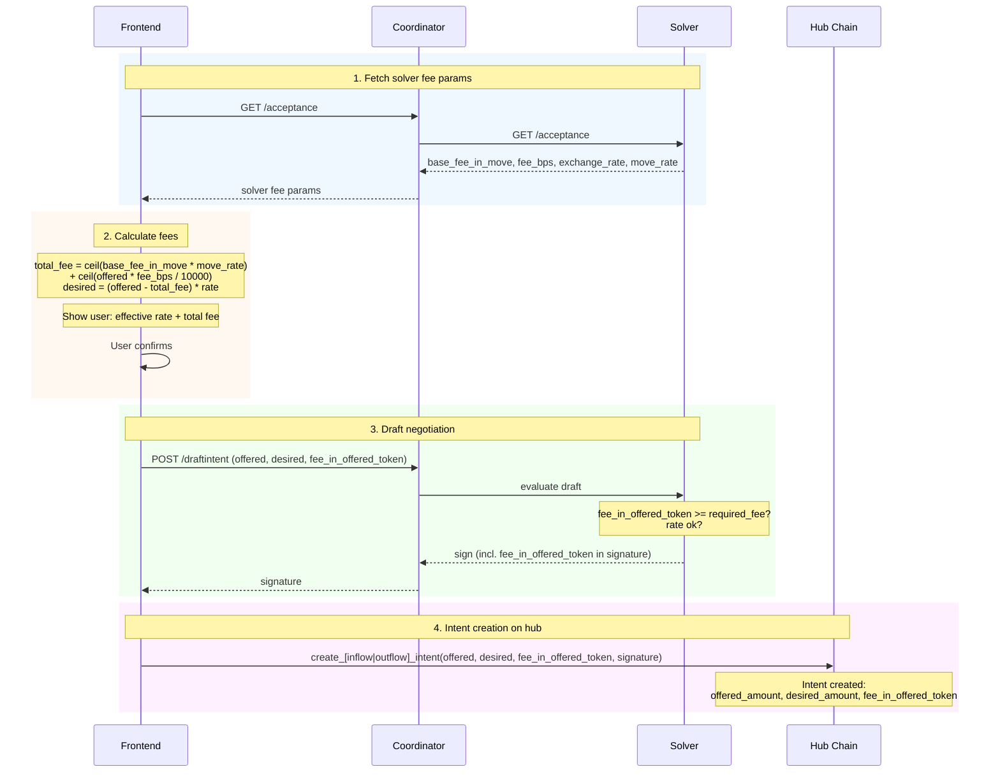

# Fee Structure

This document describes the fee mechanism for the int3nts cross-chain intent system.

## Overview

Fees are **embedded in the exchange rate** — the user receives fewer desired tokens to compensate the solver. There is no separate fee transfer or on-chain fee collection. Fees are tracked on the hub chain intent as metadata for transparency.

GMP (Generic Message Passing) costs are paid by transaction issuers as gas fees and are not part of the intent fee system.

## Fee Components

The solver advertises two fee parameters:

| Component | Field | Denomination | Description |
| --------- | ----- | ----------- | ----------- |
| Base fee | `base_fee_in_move` (u64) | MOVE (smallest units) | Flat fee covering solver's fixed operational costs (gas). Applied regardless of trade size. Single value across all token pairs. |
| Percentage fee | `fee_bps` (u64) | basis points | Fee in basis points (1 bps = 0.01%). Covers solver's opportunity cost and service margin. Scales with trade size. Per token pair. |

The base fee is denominated in **MOVE** because the solver's fixed costs (gas) are paid in MOVE on the hub chain. The protocol converts it to the offered token using the solver's base rate.

## Exchange Rates

The solver advertises a **base rate** (`exchange_rate`) per token pair — the raw conversion rate between the offered and desired token, independent of fees. For example, `1.0` means 1 offered token converts to 1 desired token.

The **effective rate** is what the user actually receives per offered token after fees are deducted. It is always lower than the base rate because fees reduce the converted amount:

```text
effective_rate = desired_amount / offered_amount
```

## Fee Calculation

The protocol converts the solver's MOVE-denominated base fee to the offered token, then adds the percentage fee:

```text
min_fee_offered = ceil(base_fee_in_move * move_rate)    # convert MOVE base fee to offered token
bps_fee         = ceil(offered_amount * fee_bps / 10000)
total_fee       = min_fee_offered + bps_fee
```

Where `move_rate` is the solver's exchange rate for MOVE → offered token (how many offered tokens per MOVE).

The fee reduces the `desired_amount` the user receives:

```text
desired_amount = (offered_amount - total_fee) * exchange_rate
```

All fee arithmetic uses smallest token units (integers). The `ceil` rounds up to the next smallest unit — not the next dollar. It only has an effect when the division isn't exact, e.g. `ceil(100 * 10 / 10000) = ceil(0.1) = 1` smallest unit.

### Example

1,000 USDC offered, base rate 1.0 (USDC→desired), base_fee_in_move 1,000,000 MOVE units (0.01 MOVE, 8 decimals), MOVE rate 0.1 USDC/MOVE, fee_bps 10 (0.1%):

```text
base_fee_in_move:          1,000,000 MOVE units (0.01 MOVE — solver's fixed cost)
move_rate:         0.1                  (USDC per MOVE)
min_fee_offered:   100,000 USDC units   (ceil(1,000,000 * 0.1) = 0.1 USDC)
bps_fee:           1,000,000            (ceil(1,000,000,000 * 10 / 10000) = 1.0 USDC)
total fee:         1,100,000            (1.1 USDC)
converted:         998,900,000 * 1.0 = 998.9 desired tokens
effective rate:    998.9 / 1000 = 0.9989
```

## Fee Breakdown Diagram

```text
                       User's offered_amount
                  ┌──────────────────────────────────┐
                  │                                   │
                  │         e.g. 1,000 USDC           │
                  │                                   │
                  └──────┬───────────────┬────────────┘
                         │               │
            ┌────────────┘               └───────────────────┐
            │                                                │
            ▼                                                ▼
   ┌───────────────────────┐                    ┌──────────────────────────┐
   │  total_fee            │                    │  offered - total_fee     │
   │  (to solver)          │                    │  (converted at rate)     │
   │                       │                    │                          │
   │  ┌────────────────┐   │                    │  998.9 USDC * 1.0       │
   │  │ base fee       │   │                    │  = 998.9 desired        │
   │  │ (fixed cost)   │   │                    │                          │
   │  │ 0.1 USDC       │   │                    │  effective rate: 0.9989  │
   │  │ (from MOVE)    │   │                    │  (998.9 / 1000 -- what   │
   │  ├────────────────┤   │                    │   user actually gets)    │
   │  │ bps fee        │   │                    │                          │
   │  │ (% cost)       │   │                    │        ┌────────────┐    │
   │  │ 1.0 USDC       │   │                    │        │ user gets  │    │
   │  │ (10bps on 1k)  │   │                    │        │ 998.9 tkn  │    │
   │  └────────────────┘   │                    │        └────────────┘    │
   │                       │                    │                          │
   │  total = 1.1 USDC     │                    └──────────────────────────┘
   └───────────────────────┘

   min_fee_offered = ceil(base_fee_in_move * move_rate)
   total_fee = min_fee_offered + ceil(offered_amount * fee_bps / 10000)
   desired_amount = (offered_amount - total_fee) * exchange_rate
   effective_rate = desired_amount / offered_amount
```

### What the frontend shows

| Field | Value | Description |
| ------- | ------- | ------------- |
| Effective rate | `desired_amount / offered_amount` | What the user actually gets per token offered (after fees) |
| Total fee | `total_fee` in offered token units | Base fee (converted from MOVE) + percentage fee |

## Fee Flow

The fee flow is the same for both inflow and outflow intents:



The fee is already embedded in the intent's `offered_amount` and `desired_amount` at creation time — no separate fee transfer occurs on-chain.

## On-Chain Tracking

The hub intent records `fee_in_offered_token` in:

- `FALimitOrder.fee_in_offered_token` — stored on-chain in the intent
- `LimitOrderEvent.fee_in_offered_token` — emitted for off-chain indexing
- `IntentToSign.fee_in_offered_token` / `IntentToSignRaw.fee_in_offered_token` — included in solver signature to prevent fee manipulation

## Solver Configuration

The solver has a single base fee in MOVE and per-pair percentage fees:

```toml
[acceptance]
base_fee_in_move = 1000000   # 0.01 MOVE (8 decimals) — covers solver gas costs

[[acceptance.tokenpair]]
source_chain_id = 30732
source_token = "0xfa_address"
target_chain_id = 11155111
target_token = "0xerc20_address"
ratio = 1.0
fee_bps = 50         # 0.5% percentage fee
```

## Validation

The solver's acceptance logic validates that the `fee_in_offered_token` in a draft intent meets its requirements:

```text
min_fee_offered = ceil(base_fee_in_move * move_rate)
required_fee = min_fee_offered + ceil(offered_amount * fee_bps / 10000)
if fee_in_offered_token < required_fee → reject draft
```
