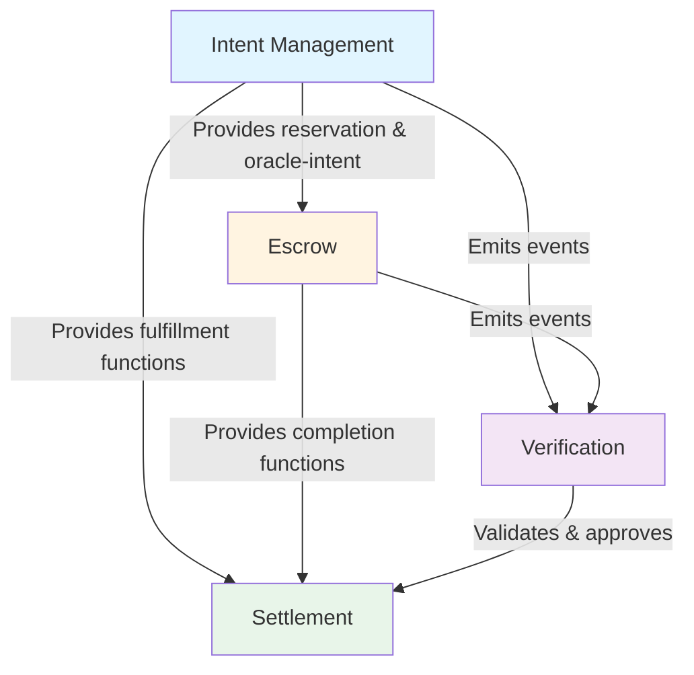
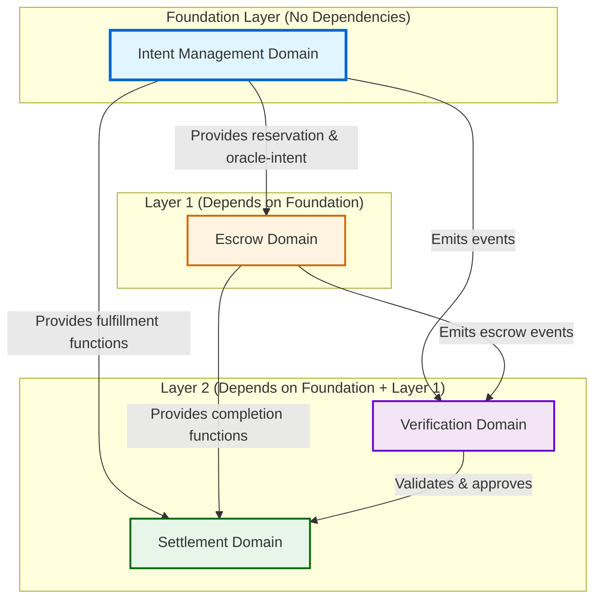

# RPG Methodology Principles

This document explains the Repository Planning Graph (RPG) methodology principles and how they apply to the Intent Framework architecture.

## Overview

RPG (Repository Planning Graph) is a methodology from Microsoft Research for creating structured, dependency-aware system designs. The key insight is to separate **WHAT** (functional capabilities) from **HOW** (structural code organization), then connect them with explicit dependencies.

## Core Principles

### 1. Dual-Semantics

**Principle**: Think about functional capabilities (what the system does) and structural organization (how code is organized) separately, then map them together.

**Application to Intent Framework**:

- **Functional View**: The system enables cross-chain intent creation, escrow management, settlement, and verification
- **Structural View**: Code is organized into domains (Intent Management, Escrow, Settlement, Verification) with specific source files
- **Mapping**: Each domain represents both a functional capability and a structural grouping of related code

### 2. Explicit Dependencies

**Principle**: Never assume dependencies - always explicitly state what depends on what. This creates clear topological ordering for development and understanding.

**Application to Intent Framework**:

- **Intent Management → Escrow**: Escrow uses intent reservation mechanisms (`intent_reservation`) and oracle-intent system (`fa_intent_with_oracle`)
- **Escrow → Verification**: Escrow emits events monitored by verifier and requires verifier public key for signature verification
- **Settlement → Intent Management**: Settlement uses fulfillment functions from Intent Management modules
- **Settlement → Escrow**: Settlement uses completion functions from Escrow modules
- **Verification → Intent Management**: Verifier monitors events from Intent Management
- **Verification → Escrow**: Verifier monitors events from Escrow and validates escrow safety

**Dependency Graph**:

### 3. Topological Order

**Principle**: Build foundation first, then layers on top. Foundation modules have no dependencies; dependent modules build on foundations.

**Application to Intent Framework**:

**Build Order**:

1. **Foundation**: Intent Management domain provides core intent structures and lifecycle management (no dependencies - implement first)
2. **Layer 1**: Escrow domain builds on Intent Management, using intent mechanisms for escrow functionality (depends on Foundation)
3. **Layer 2**: Settlement domain uses functionality from both Intent Management and Escrow (depends on Foundation + Layer 1)
4. **Layer 2**: Verification domain monitors and validates across Intent Management and Escrow domains (depends on Foundation + Layer 1)

**Implementation Sequence**:

- **Phase 1**: Implement Intent Management (can be developed and tested independently)
- **Phase 2**: Implement Escrow (requires Intent Management)
- **Phase 3**: Implement Settlement and Verification (require both Foundation and Layer 1)

### 4. Progressive Refinement

**Principle**: Start with broad, high-level understanding, then refine iteratively with more detail.

**Application to Intent Framework**:

- **Level 1**: Four domains identified (Intent Management, Escrow, Settlement, Verification)
- **Level 2**: Component mapping within each domain (specific source files)
- **Level 3**: Detailed function-level responsibilities and interactions
- **Level 4**: Cross-domain dependency patterns and data flows

## Domain Boundaries and Responsibilities

RPG methodology emphasizes clear boundaries between modules/domains. Each domain should have:

- **Single Responsibility**: One clear purpose
- **Well-Defined Interface**: Clear inputs/outputs and interaction patterns
- **Explicit Dependencies**: Documented dependencies on other domains
- **No Circular Dependencies**: Dependencies flow in one direction

### Intent Framework Domain Boundaries

**Intent Management Domain**:

- **Responsibility**: Intent lifecycle, creation, validation, event emission
- **Dependencies**: None (foundation layer)
- **Exports**: Intent structures, creation functions, fulfillment functions, events

**Escrow Domain**:

- **Responsibility**: Asset custody, fund locking, verifier integration
- **Dependencies**: Intent Management (uses reservation and oracle-intent systems)
- **Exports**: Escrow creation, completion functions, escrow events

**Settlement Domain**:

- **Responsibility**: Transaction completion and finalization
- **Dependencies**: Intent Management (fulfillment functions), Escrow (completion functions)
- **Exports**: Fulfillment, completion, and claim operations
- **Note**: Distributed across Intent Management and Escrow modules (not a separate structural module)

**Verification Domain**:

- **Responsibility**: Event monitoring, cross-chain validation, approval signatures
- **Dependencies**: Intent Management (monitors events), Escrow (monitors events, validates safety)
- **Exports**: Event monitoring API, validation functions, approval signatures

## Dependency Modeling

RPG methodology requires explicit dependency modeling to understand:

1. **Build Order**: What must be implemented first
2. **Integration Points**: Where domains interact
3. **Testing Strategy**: What can be tested independently vs. requires integration
4. **Refactoring Impact**: What breaks if a domain changes

### Intent Framework Dependency Patterns

**Data Flow Dependencies**:

- Intent Management creates intents → emits events → Verification monitors
- Escrow creates escrows → emits events → Verification monitors
- Verification validates → generates approvals → Settlement uses approvals

**Functional Dependencies**:

- Escrow uses Intent Management's reservation system
- Escrow uses Intent Management's oracle-intent system
- Settlement uses Intent Management's fulfillment functions
- Settlement uses Escrow's completion functions

**Event Dependencies**:

- Intent Management emits `LimitOrderEvent` → Verification consumes
- Intent Management emits `LimitOrderFulfillmentEvent` → Verification consumes
- Escrow emits `OracleLimitOrderEvent` / `EscrowInitialized` → Verification consumes

## Applying RPG to Architecture Documentation

When documenting the Intent Framework architecture using RPG principles:

1. **Separate Functional and Structural**: Document what each domain does (functional) separately from which files implement it (structural)
2. **Explicit Dependencies**: Always document cross-domain dependencies clearly
3. **Topological Organization**: Present domains in dependency order (foundation first)
4. **Progressive Detail**: Start with high-level domain overview, then drill into component details

## Benefits for Intent Framework

Applying RPG methodology to the Intent Framework architecture provides:

- **Clear Understanding**: Explicit dependencies make it clear how domains interact
- **Development Guidance**: Topological order guides implementation sequence
- **Maintainability**: Clear boundaries make it easier to modify individual domains
- **Testing Strategy**: Dependency graph informs what can be tested in isolation
- **Documentation Structure**: RPG principles provide a consistent framework for organizing architecture documentation

## References

- RPG methodology principles from Microsoft Research
- Task Master RPG template: `.taskmaster/templates/example_prd_rpg.txt`
