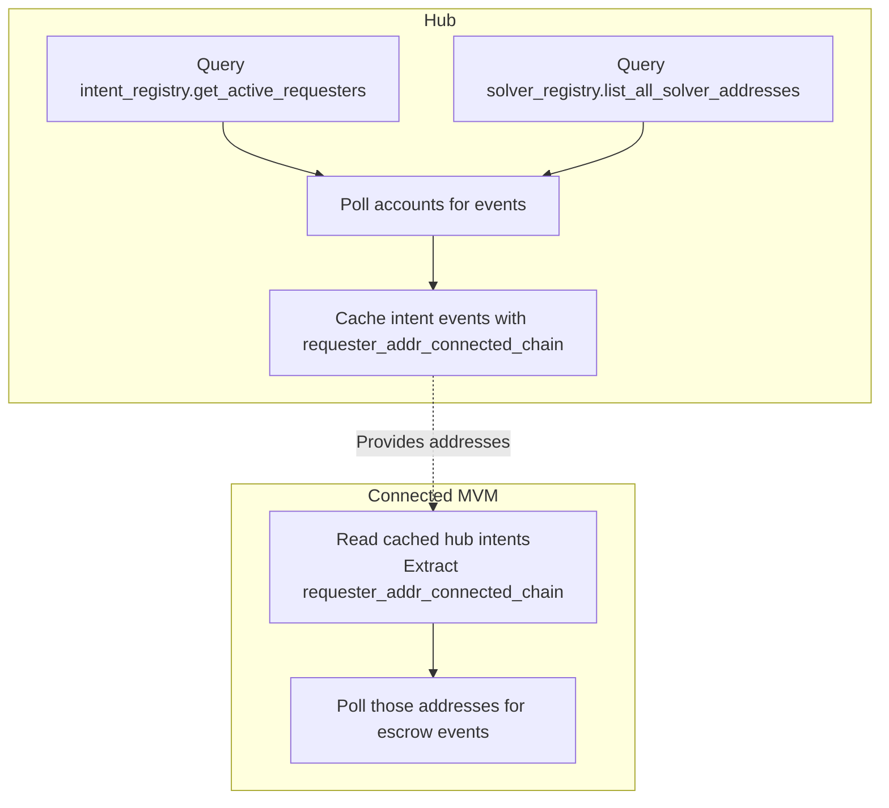
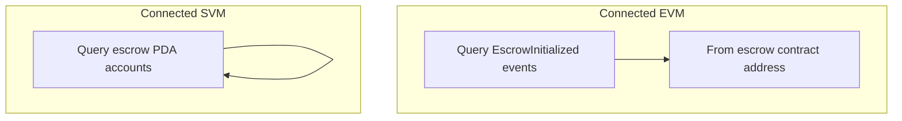

# Coordinator – Usage Guide

This guide covers how to run the coordinator service, configure chain monitoring, and understand event discovery.

## Configuration

File: `coordinator/config/coordinator.toml` (relative to project root)

- **hub_chain**: `rpc_url`, `chain_id`, `intent_module_addr` (required)
- **connected_chain_mvm**: `rpc_url`, `chain_id`, `intent_module_addr`, `escrow_module_addr` (optional, for MVM escrow monitoring)
- **connected_chain_evm**: `rpc_url`, `chain_id`, `escrow_contract_addr` (optional, for EVM escrow monitoring)
- **connected_chain_svm**: `rpc_url`, `chain_id`, `escrow_program_id` (optional, for SVM escrow monitoring)
- **api**: `host`, `port`

The coordinator automatically monitors all configured chains concurrently:

- Hub chain monitoring is always enabled
- MVM connected chain monitoring starts if `[connected_chain_mvm]` is configured
- EVM connected chain monitoring starts if `[connected_chain_evm]` is configured
- SVM connected chain monitoring starts if `[connected_chain_svm]` is configured

**Note**: The coordinator does NOT require private keys. It is read-only.

## Running

Run the full E2E test flow:

```bash
./testing-infra/ci-e2e/e2e-tests-mvm/run-tests-inflow.sh
```

This script sets up chains, deploys contracts, submits intents, runs integration tests, starts the coordinator, and releases escrow.

## Event Discovery

The coordinator uses different mechanisms to discover events on each chain:





The coordinator uses different mechanisms to discover events on each chain:

**Hub chain** — uses `intent_registry`:

1. Queries `intent_registry.get_active_requesters()` to find accounts with active intents
2. Also queries `solver_registry.list_all_solver_addresses()` for fulfillment events
3. Polls those accounts for `LimitOrderEvent`, `OracleLimitOrderEvent`, and `LimitOrderFulfillmentEvent`
4. Caches intent events (including `requester_addr_connected_chain` field)

**Connected MVM chain** — uses hub intent data (NOT registry):

1. Reads `requester_addr_connected_chain` from cached hub intents
2. Polls those addresses on the connected chain for `OracleLimitOrderEvent` (escrow)
3. The connected chain's intent_registry is not used for escrow discovery

**Connected EVM chain** — uses contract event logs:

1. Queries `EscrowInitialized` events directly from the escrow contract
2. No account polling needed (EVM events are indexed by contract address)

**Connected SVM chain** — uses program account scans:

1. Queries escrow PDA accounts for the SVM escrow program
2. Parses escrow account state and converts into escrow events

## Event Linkage

- **Hub chain**
  - `LimitOrderEvent` — inflow intent creation (issuer, amounts, metadata, expiry, revocable, solver, offered_chain_id, desired_chain_id)
  - `OracleLimitOrderEvent` — outflow intent creation (same fields + integrated-gmp public key for approvals)
  - `LimitOrderFulfillmentEvent` — fulfillment (intent_id, solver, provided amount/metadata)
- **Connected MVM chain**
  - `OracleLimitOrderEvent` (escrow) — escrow deposit with integrated-gmp public key and desired amounts
- **Connected EVM chain**
  - `EscrowInitialized` — escrow creation (intentId, requester, token, reservedSolver)
- **Connected SVM chain**
  - Escrow PDA account state — escrow creation (intent_id, requester, token_mint, reserved_solver)
- **Linking**
  - Shared `intent_id` across chains links hub intents to escrows on connected chains
  - Each `EscrowEvent` includes a `chain_type` field (Mvm, Evm, Svm) set by the coordinator based on which monitor discovered the event

## Negotiation Routing

The coordinator provides negotiation routing capabilities for off-chain communication between requesters and solvers. Requesters can submit draft intents to the coordinator, and solvers can poll for drafts and submit signatures (FCFS). See [Negotiation Routing Guide](negotiation-routing.md) for details.

## Debugging

- Useful commands:
  - `curl -s http://127.0.0.1:3333/health`
  - `curl -s http://127.0.0.1:3333/events | jq`
  - `curl -s http://127.0.0.1:3333/draftintents/pending | jq` (negotiation routing)
