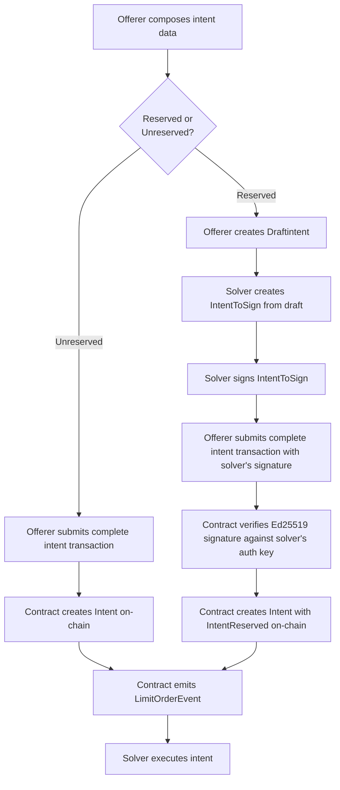

# Intent Reservation System

The intent framework supports two flows for creating trade intents:

- **Unreserved**: Anyone can solve the intent after it's created.
- **Reserved**: Only a specific solver (chosen off-chain) can solve the intent.

## Flow Diagram

## Flow Description

### Stage 1 - Common Path

1. **Offerer prepares intent parameters**: The offerer gathers the trading details (source metadata, source amount, desired metadata, desired amount, expiry time).

### Stage 2 - Two-path part

#### Unreserved Flow

2. `fa_intent.move`
   - To create an unreserved intent, the offerer calls `create_fa_to_fa_intent_entry` with an empty `solver_signature` vector, creating a `Intent` with no reservation.

#### Reserved Flow

2. `intent_reservation.move`
   - Offerer creates an `Draftintent` using `create_draft_intent` (without solver information).
3. **Negotiation** (two options):
   - **Direct**: Offerer sends draft directly to solver
   - **Coordinator-Based**: Offerer submits draft to coordinator via `POST /draftintent`, solvers poll coordinator via `GET /draftintents/pending` (FCFS)
4. `intent_reservation.move`
   - Solver creates an `IntentToSign` by calling `add_solver_to_draft_intent` to add the solver address to the draft.
5. Solver signature:
   - Solver signs the `IntentToSign` data and returns the signature to the offerer (direct) or submits to coordinator via `POST /draftintent/:id/signature` (coordinator-based).
5. `fa_intent.move`, `fa_intent_inflow.move`, or `fa_intent_outflow.move`
   - **Offerer** submits transaction calling `create_fa_to_fa_intent_entry` (or `create_inflow_intent` / `create_outflow_intent` for cross-chain) with the solver address and **solver's signature**
   - **Contract** verifies the signature:
     - For `create_fa_to_fa_intent_entry`: Calls `verify_and_create_reservation` which:
       - Gets the solver's authentication key from the blockchain
       - Extracts the Ed25519 public key from the auth key (only works for old format, 33 bytes)
       - Verifies the **solver's signature** against the `IntentToSign` data using `ed25519::signature_verify_strict`
       - If verification succeeds, creates an `IntentReserved` struct
       - If verification fails, the transaction aborts with `EINVALID_SIGNATURE` or `EINVALID_AUTH_KEY_FORMAT`
     - For `create_inflow_intent` or `create_outflow_intent`: Uses `verify_and_create_reservation_from_registry` which:
       - Looks up the solver's public key from the on-chain solver registry
       - Verifies the **solver's signature** against the `IntentToSign` data using `ed25519::signature_verify_strict`
       - If verification succeeds, creates an `IntentReserved` struct
       - If verification fails, the transaction aborts with `EINVALID_SIGNATURE` or `ESOLVER_NOT_REGISTERED`

   **Note**: For cross-chain intents, the solver must be registered in the solver registry before creating the intent. The registry stores the solver's Ed25519 public key on-chain, eliminating the need to pass it explicitly.

### Stage 3 - Common Path

6. `intent.move`
   - The internal `create_fa_to_fa_intent` (from `fa_intent.move`) uses the intent data to escrow assets, emits `LimitOrderEvent`, and delegates to `intent::create_intent`.
   - `intent::create_intent` persists the `Intent` object, storing the reservation data if it exists.
7. `fa_intent.move`
   - A solver calls `start_fa_offering_session`, which wraps `intent::start_intent_session`.
   - If the intent is reserved, this function first calls `intent_reservation::ensure_solver_authorized`.
   - Settlement uses `finish_fa_receiving_session`, which validates payment before calling `intent::finish_intent_session`.

