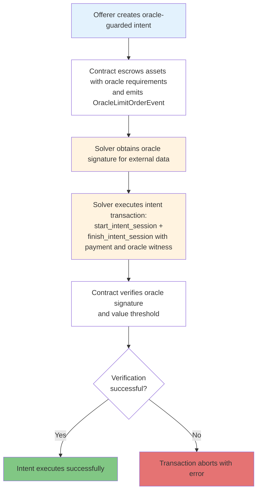

# Oracle-Guarded Intents

The Intent Framework supports a third type of intent that requires oracle approval before execution. Oracle-guarded intents enable conditional trading based on external data (such as price feeds) that must be verified by authorized oracles.

## Overview

Oracle-guarded intents extend the base fungible asset intent flow by adding an oracle signature requirement. Offerers still escrow a single fungible asset, but settlement succeeds only when the solver supplies a signed report from an authorized oracle whose reported value meets the threshold chosen by the creator.

## Oracle Intent Flow



## Data Structures

#### OracleSignatureRequirement

Defines the oracle requirements for an intent:

```move
struct OracleSignatureRequirement has store, drop {
    min_reported_value: u64,                    // Minimum value oracle must report
    public_key: ed25519::UnvalidatedPublicKey,  // Authorized oracle's public key
}
```

#### OracleGuardedLimitOrder

Trading conditions for an oracle-guarded limit order:

```move
struct OracleGuardedLimitOrder has store, drop {
    desired_metadata: Object<Metadata>,         // Desired asset metadata
    desired_amount: u64,                        // Desired asset amount
    issuer: address,                            // Intent creator
    requirement: OracleSignatureRequirement,    // Oracle requirements
}
```

#### OracleSignatureWitness

Proof that an oracle has signed off on external data:

```move
struct OracleSignatureWitness has drop {
    reported_value: u64,        // Value reported by oracle
    signature: ed25519::Signature, // Oracle's signature
}
```

## Key Features

#### 1. Oracle Authorization

- Only oracles with pre-authorized public keys can sign off on intents
- Oracle public keys are specified when creating the intent
- Signature verification ensures data authenticity

#### 2. Value Thresholds

- Intent creators set minimum reported values
- Oracle-reported values must meet or exceed the threshold
- Enables conditional execution based on external data

#### 3. Signature Verification

- Uses Ed25519 cryptographic signatures
- Verifies oracle signatures against reported data
- Ensures data integrity and oracle authenticity

## Use Cases

#### Price-Based Trading

```move
// Create intent that executes only if BTC price >= $50,000
let oracle_requirement = new_oracle_signature_requirement(
    50000,  // Minimum BTC price
    btc_oracle_public_key
);
```

#### Time-Based Conditions

```move
// Create intent that executes only after specific timestamp
let oracle_requirement = new_oracle_signature_requirement(
    target_timestamp,  // Minimum timestamp
    time_oracle_public_key
);
```

#### Cross-Chain Data

```move
// Create intent based on data from another chain
let oracle_requirement = new_oracle_signature_requirement(
    cross_chain_value,  // Value from external chain
    bridge_oracle_public_key
);
```

## Security Considerations

#### Oracle Trust

- Intent creators must trust the specified oracle
- Oracle compromise affects all intents using that oracle
- Consider using multiple oracles for critical intents

#### Signature Verification

- All signatures are verified on-chain
- Uses Ed25519 for cryptographic security
- Prevents signature forgery and replay attacks

#### Value Manipulation

- Oracles must be resistant to manipulation
- Consider oracle reputation and economic incentives
- Use multiple data sources when possible

## Example Implementation

```move
// Create oracle-guarded intent
let oracle_intent = create_oracle_guarded_intent(
    source_asset,
    oracle_requirement,
    expiry_time,
    issuer
);

// Solver executes with oracle signature
let session = start_oracle_intent_session(oracle_intent);
let witness = new_oracle_signature_witness(
    oracle_reported_value,
    oracle_signature
);
finish_oracle_intent_session(session, witness);
```

For complete API reference, see [API Reference](api-reference.md#oracle-intent-api).
