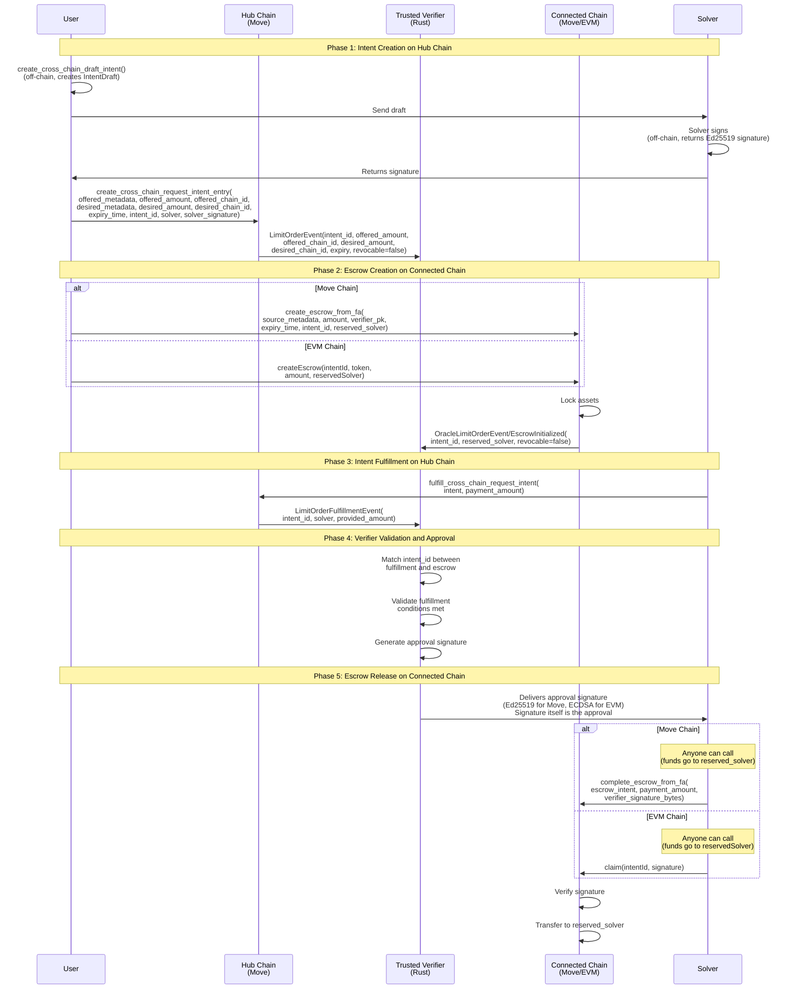
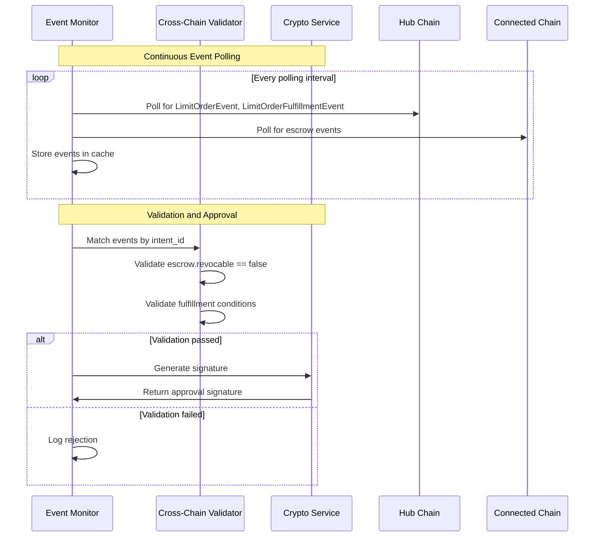

# Protocol Specification

This document specifies the cross-chain intent protocol: how intents, escrows, and verifiers work together across chains. For component-specific implementation details, see the [component documentation](#component-documentation).

## Table of Contents

- [Protocol Overview](#protocol-overview)
- [Cross-Chain Flow](#cross-chain-flow)
- [Cross-Chain Linking Mechanism](#cross-chain-linking-mechanism)
- [Verifier Validation Protocol](#verifier-validation-protocol)
- [Security Requirements](#security-requirements)

## Protocol Overview

The cross-chain intent protocol enables secure asset transfers between chains using a verifier-based approval mechanism:

1. **Hub Chain**: Intents are created and fulfilled (see [Move Intent Framework](move-intent-framework/README.md))
2. **Connected Chain**: Escrows lock funds awaiting verifier approval (see [EVM Intent Framework](evm-intent-framework/README.md) or Move escrows)
3. **Verifier Service**: Monitors both chains and provides approval signatures (see [Trusted Verifier](trusted-verifier/README.md))

The protocol links these components using `intent_id` to correlate events across chains.

## Cross-Chain Flow

The intent framework enables cross-chain escrow operations where intents are created on a hub chain and escrows are created on connected chains. The verifier monitors both chains and provides approval signatures to authorize escrow release.

### Standard Flow



### Flow Steps

1. **Off-chain (before Hub)**: User and solver negotiate using the reserved intent flow:
   - **Step 1**: User creates draft using `create_cross_chain_draft_intent()` with `offered_amount` (amount that will be locked in escrow on connected chain), `offered_chain_id`, and `desired_chain_id`
   - **Step 2**: Solver adds their address using `add_solver_to_draft_intent()`, signs the `IntentToSign` using `hash_intent()`, and returns the Ed25519 signature
2. **Hub**: User calls `create_cross_chain_request_intent_entry()` with `offered_amount` (amount that will be locked in escrow on connected chain), `intent_id`, `offered_chain_id`, `desired_chain_id`, `solver` address, and `solver_signature`. The function looks up the solver's public key from the on-chain solver registry, verifies the signature, and creates a reserved intent (emits `LimitOrderEvent` with `offered_amount`, `offered_chain_id`, `desired_chain_id`, `revocable=false`). The intent is **reserved** for the specified solver, ensuring solver commitment across chains.

   **Note**: The solver must be registered in the solver registry before calling this function. The public key is stored on-chain in the registry, eliminating the need to pass it explicitly.
3. **Connected Chain**: User creates escrow using `create_escrow_from_fa()` (Move) or `createEscrow()` (EVM) with `intent_id`, verifier public key, and **reserved solver address** (emits `OracleLimitOrderEvent`/`EscrowInitialized`, `revocable=false`).
4. **Solver**: Observes the request intent on Hub chain (from step 2) and the escrow on Connected Chain (from step 3).
5. **Hub**: Solver fulfills the intent using `fulfill_cross_chain_request_intent()` (emits `LimitOrderFulfillmentEvent`)
6. **Verifier**: observes fulfillment + escrow, signs the `intent_id` to generate approval signature (signature itself is the approval)
7. **Anyone**: submits `complete_escrow_from_fa()` (Move) or `claim()` (EVM) on connected chain with verifier signature (Ed25519 for Move, ECDSA for EVM). The transaction can be sent by anyone, but funds always transfer to the reserved solver address specified at escrow creation.

**Note**: All escrows must specify a reserved solver address at creation. Funds are always transferred to the reserved solver when the escrow is claimed, regardless of who sends the transaction.

## Cross-Chain Linking Mechanism

The protocol uses `intent_id` to link intents across chains:

### Intent ID Assignment

1. **Hub Chain Regular Intent**:
   - `intent_id` = `intent_address` (object address)
   - Stored in `LimitOrderEvent.intent_id`

2. **Hub Chain Cross-Chain Request Intent**:
   - `intent_id` explicitly provided as parameter
   - Used when tokens are locked on a different chain
   - Stored in `FungibleAssetLimitOrder.intent_id` as `Option<address>`

3. **Connected Chain Escrow**:
   - `intent_id` provided at creation, linking to hub intent
   - Must match hub chain intent's `intent_id` for verifier matching

### Event Correlation

The verifier matches events across chains:

```text
Hub Chain: LimitOrderEvent.intent_id
    ↓
    (matches)
    ↓
Connected Chain: OracleLimitOrderEvent.intent_id / EscrowInitialized.intentId
```

**Matching Process**:

1. Verifier observes `LimitOrderEvent` → stores `RequestIntentEvent` with `intent_id`
2. Verifier observes escrow event → stores `EscrowEvent` with `intent_id`
3. When `LimitOrderFulfillmentEvent` observed → matches `fulfillment.intent_id` with `escrow.intent_id`
4. If match found and validation passes → generates approval signature

## Verifier Validation Protocol

The verifier performs cross-chain validation before generating approvals:

### Validation Steps

1. **Intent Safety Check**: Validates `escrow.revocable == false` (CRITICAL - see [Security Requirements](#security-requirements))
2. **Event Matching**: Links escrow events to intent events via `intent_id`
3. **Fulfillment Verification**: Confirms hub intent fulfillment occurred
4. **Condition Validation**: Verifies fulfillment meets escrow requirements
5. **Approval Generation**: Creates cryptographic signature (Ed25519 for Move, ECDSA for EVM)

### Validation Workflow



For detailed validation logic, see [Trusted Verifier](trusted-verifier/README.md).

## Security Requirements

### Non-Revocable Escrow Validation

⚠️ **CRITICAL**: All escrow intents MUST be created with `revocable = false`.

**Why**: Escrow funds must remain locked until verifier approval or expiry. If escrows were revocable, users could withdraw funds after verifiers trigger actions elsewhere, breaking the protocol's security guarantees.

**Enforcement**:

- Move escrow creation enforces non-revocable: `intent_as_escrow.move:109`
- Verifier validates before approval: `trusted-verifier/src/validator/mod.rs:99-105`
- EVM escrows use contract-defined expiry instead of revocation

### Reserved Solver Address

All escrows MUST specify a reserved solver address at creation:

- **Move Escrows**: `reservation: IntentReserved` required
- **EVM Escrows**: `reservedSolver` parameter required (never `address(0)`)
- Funds ALWAYS transfer to reserved solver, regardless of transaction sender
- Prevents signature replay attacks

**Security Benefit**: Even if approval signature is leaked, funds can only go to the authorized solver address.

### Cryptographic Operations

**Aptos/Move Chains**:

- Ed25519 signatures for verifier approvals
- Signature over BCS-encoded `intent_id` (address) - the signature itself is the approval
- Public key embedded in escrow creation

**EVM Chains**:

- ECDSA signatures for verifier approvals
- Message: `keccak256(intentId)` - signature itself is the approval
- Ethereum signed message format
