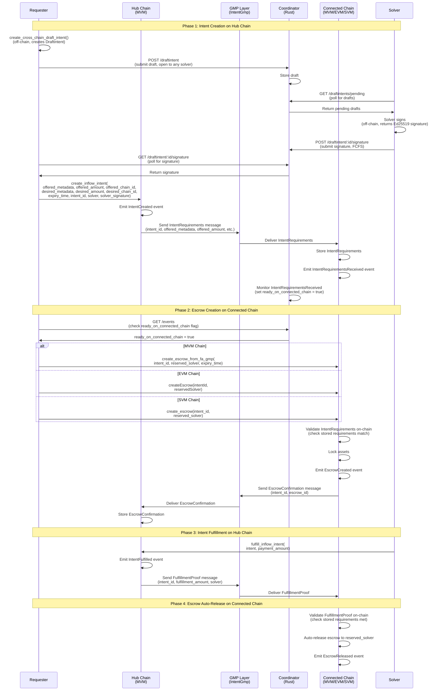
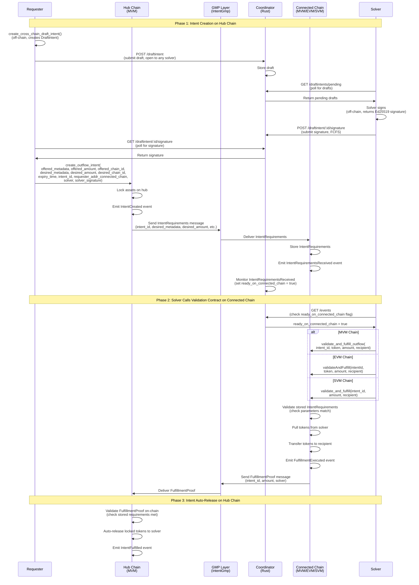

# Protocol Specification

This document specifies the cross-chain intent protocol: how intents, escrows, coordinator, and trusted-gmp services work together across chains. For component-specific implementation details, see the component README files in the repository.

## Table of Contents

- [Protocol Overview](#protocol-overview)
- [Cross-Chain Flow](#cross-chain-flow)
- [Cross-Chain Linking Mechanism](#cross-chain-linking-mechanism)
- [GMP Message Types](#gmp-message-types)
- [On-Chain Validation](#on-chain-validation)

## Protocol Overview

The cross-chain intent protocol enables secure asset transfers between chains using GMP (Generic Message Passing) for cross-chain communication:

1. **Hub Chain**: Intents are created and fulfilled (see [MVM Intent Framework](intent-frameworks/mvm/README.md))
2. **Connected Chain**: Escrows lock funds and validate requirements delivered via GMP (see [Intent Frameworks](intent-frameworks/README.md))
3. **GMP Layer**: Cross-chain message passing for IntentRequirements, EscrowConfirmation, and FulfillmentProof messages (see [Intent GMP](intent-frameworks/README.md))
4. **Validation Contracts**: On-chain contracts on connected chains validate and execute fulfillments (see [IntentOutflowValidator](intent-frameworks/evm/contracts/IntentOutflowValidator.sol))
5. **Coordinator Service**: Monitors all chains, provides event caching, readiness tracking, and negotiation routing (see [Coordinator](coordinator/README.md))

The protocol links these components using `intent_id` to correlate events and GMP messages across chains.

### Coordinator Readiness Tracking

For outflow intents (GMP-based), the coordinator monitors `IntentRequirementsReceived` events on connected chains (MVM, EVM, SVM) and provides a `ready_on_connected_chain` flag. This enables frontends and solvers to query the coordinator API to know when intent requirements have been delivered via GMP, without needing to poll connected chains directly. See [Coordinator API](coordinator/README.md) for details.

## Cross-Chain Flow

The intent framework enables cross-chain escrow operations where intents are created on a hub chain and escrows are created on connected chains. GMP handles cross-chain message delivery (IntentRequirements, EscrowConfirmation, FulfillmentProof). The coordinator monitors all chains, caches events, and tracks readiness status.

### Inflow Flow



### Inflow Flow Steps

1. **Off-chain (before Hub)**: Requester and solver negotiate using coordinator-based negotiation routing:
   - **Step 1**: Requester submits draft to coordinator via `POST /draftintent` (draft is open to any solver)
   - **Step 2**: Solvers poll coordinator via `GET /draftintents/pending` to discover drafts
   - **Step 3**: First solver to sign submits signature via `POST /draftintent/:id/signature` (FCFS)
   - **Step 4**: Requester polls coordinator via `GET /draftintent/:id/signature` to retrieve signature

   See [Negotiation Routing Guide](coordinator/negotiation-routing.md) for details.

2. **Hub Intent Creation**: Requester calls `create_inflow_intent()` with `offered_amount` (amount that will be locked in escrow on connected chain), `intent_id`, `offered_chain_id`, `desired_chain_id`, `solver` address, and `solver_signature`. The function:
   - Looks up the solver's public key from the on-chain solver registry
   - Verifies the signature
   - Creates a reserved intent (emits `IntentCreated` event)
   - Sends `IntentRequirements` message via GMP to the connected chain

   **Note**: The solver must be registered in the solver registry before calling this function. The registry stores the solver's Ed25519 public key (for signature verification) and connected chain addresses. See the [Solver Registry API](../docs/intent-frameworks/mvm/api-reference.md#solver-registry-api) for registration details.

3. **GMP Delivery to Connected Chain**: GMP layer delivers `IntentRequirements` message to the connected chain. The connected chain:
   - Stores the IntentRequirements on-chain
   - Emits `IntentRequirementsReceived` event
   - Coordinator monitors this event and sets `ready_on_connected_chain = true`

4. **Escrow Creation on Connected Chain**: Requester queries coordinator (`GET /events`) to check `ready_on_connected_chain` flag, then creates escrow using `create_escrow_from_fa_gmp()` (MVM), `createEscrow()` (EVM), or `create_escrow()` (SVM) with `intent_id` and **reserved solver address**. The escrow contract:
   - Validates that stored IntentRequirements match the intent_id
   - Locks assets in escrow
   - Emits `EscrowCreated` event
   - Sends `EscrowConfirmation` message via GMP back to hub

5. **Hub Intent Fulfillment**: Solver fulfills the intent on hub using `fulfill_inflow_intent()`:
   - Emits `IntentFulfilled` event
   - Sends `FulfillmentProof` message via GMP to connected chain

6. **Escrow Auto-Release**: Connected chain receives `FulfillmentProof` via GMP and:
   - Validates that fulfillment matches stored IntentRequirements
   - Auto-releases escrow to the reserved solver address
   - Emits `EscrowReleased` event

**Note**: The escrow auto-releases on GMP message receipt - no signatures required. All validation happens on-chain using the stored IntentRequirements.

### Outflow Flow

The outflow flow is the reverse of the inflow flow: tokens are locked on the hub chain and desired on the connected chain. The solver calls a validation contract on the connected chain that validates requirements, executes the transfer, and sends a FulfillmentProof back to the hub via GMP.



### Outflow Flow Steps

1. **Off-chain (before Hub)**: Requester and solver negotiate using coordinator-based negotiation routing:
   - **Step 1**: Requester submits draft to coordinator via `POST /draftintent` (draft is open to any solver)
   - **Step 2**: Solvers poll coordinator via `GET /draftintents/pending` to discover drafts
   - **Step 3**: First solver to sign submits signature via `POST /draftintent/:id/signature` (FCFS)
   - **Step 4**: Requester polls coordinator via `GET /draftintent/:id/signature` to retrieve signature

   See [Negotiation Routing Guide](coordinator/negotiation-routing.md) for details.

2. **Hub Intent Creation**: Requester calls `create_outflow_intent()` with `offered_amount` (amount to lock on hub), `intent_id`, `offered_chain_id` (hub), `desired_chain_id` (connected), `requester_addr_connected_chain` (where solver should send tokens), `solver` address, and `solver_signature`. The function:
   - Locks tokens on the hub
   - Emits `IntentCreated` event
   - Sends `IntentRequirements` message via GMP to the connected chain

3. **GMP Delivery to Connected Chain**: GMP layer delivers `IntentRequirements` message to the connected chain. The connected chain:
   - Stores the IntentRequirements on-chain
   - Emits `IntentRequirementsReceived` event
   - Coordinator monitors this event and sets `ready_on_connected_chain = true`

4. **Solver Calls Validation Contract**: Solver queries coordinator (`GET /events`) to check `ready_on_connected_chain` flag, then calls the validation contract on the connected chain (`validate_and_fulfill_outflow()` for MVM, `validateAndFulfill()` for EVM, `validate_and_fulfill()` for SVM). The validation contract:
   - Validates that stored IntentRequirements match the parameters
   - Pulls tokens from the solver's account
   - Transfers tokens to `requester_addr_connected_chain`
   - Emits `FulfillmentExecuted` event
   - Sends `FulfillmentProof` message via GMP to hub

5. **Hub Intent Auto-Release**: Hub receives `FulfillmentProof` via GMP and:
   - Validates that fulfillment matches stored IntentRequirements
   - Auto-releases locked tokens to the solver
   - Emits `IntentFulfilled` event

6. **Result**: Requester receives tokens on connected chain, solver receives locked tokens from hub as reward.

**Key Differences from Inflow Flow**:

- Tokens are locked on hub (not connected chain)
- No escrow on connected chain - validation contract handles fulfillment atomically
- Validation contract pulls tokens from solver, validates requirements, forwards to recipient, and sends GMP message
- Solver receives locked tokens from hub as payment for their work

## Cross-Chain Linking Mechanism

The protocol uses `intent_id` to link intents, GMP messages, and escrows across chains:

### Intent ID Assignment

1. **Hub Chain Regular Intent**:
   - `intent_id` = `intent_addr` (object address)
   - Stored in `IntentCreated` event

2. **Hub Chain Cross-Chain Request Intent**:
   - `intent_id` explicitly provided as parameter
   - Used for both inflow and outflow intents
   - Stored in `FALimitOrder.intent_id` as `Option<address>`

3. **GMP Messages**:
   - All GMP messages include `intent_id` as a field
   - `IntentRequirements`, `EscrowConfirmation`, and `FulfillmentProof` messages all carry the same `intent_id`

4. **Connected Chain Escrow**:
   - `intent_id` provided at creation, linking to hub intent
   - Must match the `intent_id` from the stored IntentRequirements

### Event and Message Correlation

The coordinator monitors events and GMP messages across chains:

```text
Hub Chain: IntentCreated.intent_id
    ↓
    (GMP message)
    ↓
Connected Chain: IntentRequirementsReceived.intent_id
    ↓
    (stored on-chain)
    ↓
Connected Chain: EscrowCreated.intent_id / FulfillmentExecuted.intent_id
    ↓
    (GMP message)
    ↓
Hub Chain: EscrowConfirmation.intent_id / FulfillmentProof.intent_id
```

**Correlation Process**:

1. Hub emits `IntentCreated` event → sends `IntentRequirements` via GMP with `intent_id`
2. Connected chain receives GMP message → emits `IntentRequirementsReceived` with `intent_id`
3. Coordinator monitors `IntentRequirementsReceived` → sets `ready_on_connected_chain = true`
4. Escrow/Validation contract validates against stored requirements using `intent_id`
5. Connected chain sends confirmation/proof via GMP back to hub with same `intent_id`

## GMP Message Types

The protocol uses three types of GMP messages to communicate cross-chain state:

### IntentRequirements

Sent from hub to connected chain when an intent is created. Contains all parameters needed for validation:

**Fields:**
- `intent_id`: Unique identifier linking hub intent to connected chain operations
- `offered_metadata`: Token type on connected chain (for inflow) or hub (for outflow)
- `offered_amount`: Amount to be locked
- `desired_metadata`: Token type on hub (for inflow) or connected chain (for outflow)
- `desired_amount`: Amount to be received
- `requester_addr`: Requester's address on connected chain (for outflow only)
- `expiry_time`: Intent expiration timestamp

**Purpose:**
- Inflow: Connected chain escrows validate these requirements before locking funds
- Outflow: Connected chain validation contracts validate these requirements before executing transfers

### EscrowConfirmation

Sent from connected chain to hub when an escrow is successfully created (inflow only).

**Fields:**
- `intent_id`: Links to the hub intent
- `escrow_id`: Connected chain escrow identifier
- `reserved_solver`: Solver address that will receive funds

**Purpose:**
- Confirms to hub that escrow was created successfully
- Enables hub-side tracking of escrow status

### FulfillmentProof

Sent from connected chain to hub (outflow) or from hub to connected chain (inflow) when fulfillment occurs.

**Fields:**
- `intent_id`: Links to the intent
- `amount`: Amount fulfilled
- `solver`: Solver address that fulfilled the intent

**Purpose:**
- Inflow: Proves to connected chain that hub intent was fulfilled → triggers escrow release
- Outflow: Proves to hub that connected chain transfer occurred → triggers hub intent release

## On-Chain Validation

All validation happens on-chain using stored IntentRequirements. No off-chain signatures or trusted services are required for validation.

### Inflow Validation (Escrow Contracts)

**Escrow Creation Validation:**

1. **Requirement Storage Check**: Escrow contract reads stored IntentRequirements by `intent_id`
2. **Parameter Matching**: Validates escrow parameters match requirements:
   - Token metadata matches `offered_metadata`
   - Amount matches `offered_amount`
   - Expiry time is valid
3. **Lock Funds**: If validation passes, lock funds in escrow
4. **Send Confirmation**: Send `EscrowConfirmation` via GMP to hub

**Escrow Release Validation:**

1. **GMP Message Receipt**: Escrow contract receives `FulfillmentProof` via GMP
2. **Requirement Validation**: Validates fulfillment matches stored IntentRequirements:
   - `intent_id` matches
   - Fulfilled amount meets `desired_amount`
   - Solver address matches reserved solver
3. **Auto-Release**: If validation passes, automatically release funds to reserved solver

**Key Properties:**
- No signatures required - validation uses on-chain GMP messages
- Trustless - all validation logic is on-chain
- Atomic - escrow creation and validation happen in single transaction

### Outflow Validation (Validation Contracts)

**Validation Contract Execution:**

1. **Solver Calls Contract**: Solver calls `validateAndFulfill()` with token, amount, recipient, and intent_id
2. **Requirement Storage Check**: Contract reads stored IntentRequirements by `intent_id`
3. **Parameter Matching**: Validates parameters match requirements:
   - Token metadata matches `desired_metadata`
   - Amount matches `desired_amount`
   - Recipient matches `requester_addr`
4. **Execute Transfer**: If validation passes:
   - Pull tokens from solver's account
   - Transfer tokens to recipient
   - Send `FulfillmentProof` via GMP to hub
5. **Hub Auto-Release**: Hub receives GMP message and auto-releases locked funds to solver

**Key Properties:**
- Atomic - validation, transfer, and GMP message sending happen in single transaction
- No pre-funding required - solver provides tokens in the same transaction
- Trustless - all validation logic is on-chain
- No signatures required - validation uses stored IntentRequirements

### Validation Contract Implementations

**MVM (Movement)**:
- Module: `intent_outflow_validator`
- Function: `validate_and_fulfill_outflow()`
- Location: `intent-frameworks/mvm/sources/intent_outflow_validator.move`

**EVM (Ethereum)**:
- Contract: `IntentOutflowValidator.sol`
- Function: `validateAndFulfill()`
- Location: `intent-frameworks/evm/contracts/IntentOutflowValidator.sol`

**SVM (Solana)**:
- Program: `intent-outflow-validator`
- Instruction: `validate_and_fulfill`
- Location: `intent-frameworks/svm/programs/intent-outflow-validator/src/lib.rs`

For detailed implementation, see [Intent Frameworks](intent-frameworks/README.md).
