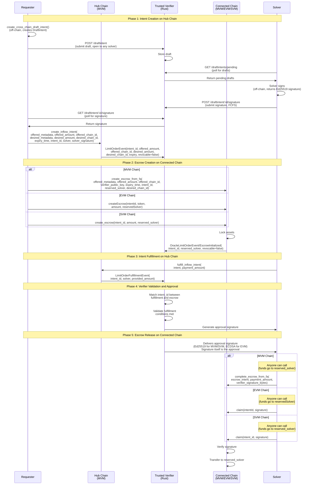
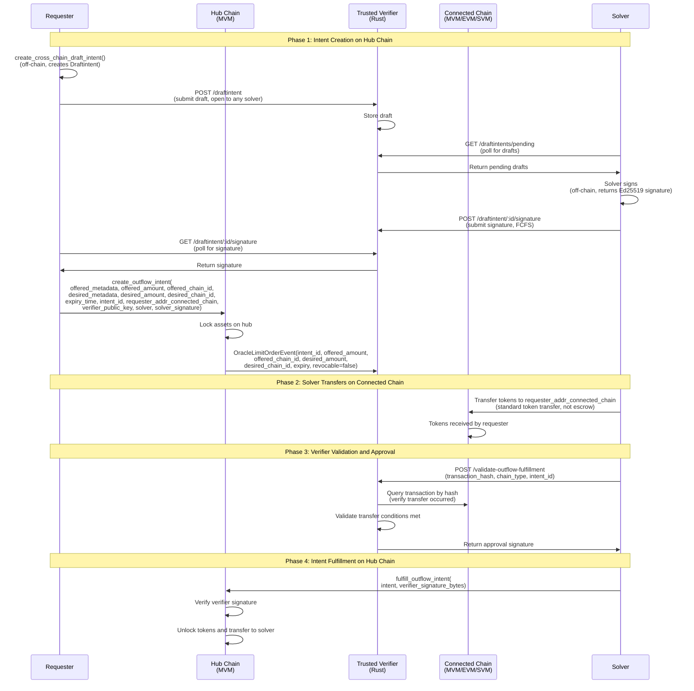
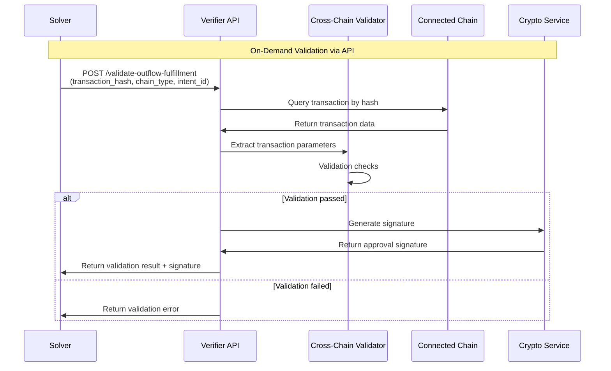

# Protocol Specification

This document specifies the cross-chain intent protocol: how intents, escrows, and verifiers work together across chains. For component-specific implementation details, see the component README files in the repository.

## Table of Contents

- [Protocol Overview](#protocol-overview)
- [Cross-Chain Flow](#cross-chain-flow)
- [Cross-Chain Linking Mechanism](#cross-chain-linking-mechanism)
- [Verifier Validation Protocol](#verifier-validation-protocol)

## Protocol Overview

The cross-chain intent protocol enables secure asset transfers between chains using a verifier-based approval mechanism:

1. **Hub Chain**: Intents are created and fulfilled (see [MVM Intent Framework](move-intent-framework/README.md))
2. **Connected Chain**: Escrows lock funds awaiting verifier approval (see [MVM Intent Framework](move-intent-framework/README.md), [EVM Intent Framework](evm-intent-framework/README.md), [SVM Intent Framework](svm-intent-framework/README.md), or MVM escrows)
3. **Verifier Service**: Monitors both chains and provides approval signatures (see [Trusted Verifier](trusted-verifier/README.md))

The protocol links these components using `intent_id` to correlate events across chains.

## Cross-Chain Flow

The intent framework enables cross-chain escrow operations where intents are created on a hub chain and escrows are created on connected chains. The verifier monitors both chains and provides approval signatures to authorize escrow release.

### Inflow Flow



### Inflow Flow Steps

1. **Off-chain (before Hub)**: Requester and solver negotiate using verifier-based negotiation routing:
   - **Step 1**: Requester submits draft to verifier via `POST /draftintent` (draft is open to any solver)
   - **Step 2**: Solvers poll verifier via `GET /draftintents/pending` to discover drafts
   - **Step 3**: First solver to sign submits signature via `POST /draftintent/:id/signature` (FCFS)
   - **Step 4**: Requester polls verifier via `GET /draftintent/:id/signature` to retrieve signature

   See [Negotiation Routing Guide](trusted-verifier/negotiation-routing.md) for details.
2. **Hub**: Requester calls `create_inflow_intent()` with `offered_amount` (amount that will be locked in escrow on connected chain), `intent_id`, `offered_chain_id`, `desired_chain_id`, `solver` address, and `solver_signature`. The function looks up the solver's public key from the on-chain solver registry, verifies the signature, and creates a reserved intent (emits `LimitOrderEvent` with `offered_amount`, `offered_chain_id`, `desired_chain_id`, `revocable=false`). The intent is **reserved** for the specified solver, ensuring solver commitment across chains.

   **Note**: The solver must be registered in the solver registry before calling this function. The registry stores the solver's Ed25519 public key (for signature verification) and connected chain addresses (for outflow validation). See the [Solver Registry API](../docs/move-intent-framework/api-reference.md#solver-registry-api) for registration details.
3. **Connected Chain**: Requester creates escrow using `create_escrow_from_fa()` (MVM), `createEscrow()` (EVM), or `create_escrow()` (SVM) with `intent_id`, verifier public key, and **reserved solver address** (emits `OracleLimitOrderEvent`/`EscrowInitialized`, `revocable=false`).
4. **Solver**: Observes the intent on Hub chain (from step 2) and the escrow on Connected Chain (from step 3).
5. **Hub**: Solver fulfills the intent using `fulfill_inflow_intent()` (emits `LimitOrderFulfillmentEvent`)
6. **Verifier**: observes fulfillment + escrow, signs the `intent_id` to generate approval signature (signature itself is the approval)
7. **Anyone**: submits `complete_escrow_from_fa()` (MVM), `claim()` (EVM), or `claim()` (SVM) on connected chain with verifier signature (Ed25519 for MVM/SVM, ECDSA for EVM). The transaction can be sent by anyone, but funds always transfer to the reserved solver address specified at escrow creation.

**Note**: All escrows must specify a reserved solver address at creation. Funds are always transferred to the reserved solver when the escrow is claimed, regardless of who sends the transaction.

### Outflow Flow

The outflow flow is the reverse of the inflow flow: tokens are locked on the hub chain and desired on the connected chain. The solver transfers tokens on the connected chain first, then receives the locked tokens from the hub as reward.



### Outflow Flow Steps

1. **Off-chain (before Hub)**: Requester and solver negotiate using verifier-based negotiation routing:
   - **Step 1**: Requester submits draft to verifier via `POST /draftintent` (draft is open to any solver)
   - **Step 2**: Solvers poll verifier via `GET /draftintents/pending` to discover drafts
   - **Step 3**: First solver to sign submits signature via `POST /draftintent/:id/signature` (FCFS)
   - **Step 4**: Requester polls verifier via `GET /draftintent/:id/signature` to retrieve signature
   See [Negotiation Routing Guide](trusted-verifier/negotiation-routing.md) for details.
2. **Hub**: Requester calls `create_outflow_intent()` with `offered_amount` (amount to lock on hub), `intent_id`, `offered_chain_id` (hub), `desired_chain_id` (connected), `requester_addr_connected_chain` (where solver should send tokens), `verifier_public_key`, `solver` address, and `solver_signature`. The function locks tokens on the hub and creates an oracle-guarded intent requiring verifier signature (emits `OracleLimitOrderEvent` with `revocable=false`).
3. **Connected Chain**: Solver transfers tokens directly to `requester_addr_connected_chain` using standard token transfer (not an escrow). The transaction must include `intent_id` as metadata for verifier tracking (memo for SVM). See [Connected Chain Outflow Fulfillment Transaction Format](#connected-chain-outflow-fulfillment-transaction-format) for exact specification.
4. **Solver**: Calls the verifier REST API endpoint `POST /validate-outflow-fulfillment` with the transaction hash, chain type, and intent ID.
5. **Verifier**: Validates the transaction matches the hub intent requirements and generates approval signature by signing the `intent_id`.
6. **Hub**: Solver calls `fulfill_outflow_intent()` with the verifier signature. The function verifies the signature, unlocks the tokens locked on hub, and transfers them to the solver as reward.
7. **Result**: Requester receives tokens on connected chain, solver receives locked tokens from hub as reward.

**Key Differences from Inflow Flow**:

- Tokens are locked on hub (not connected chain)
- No escrow on connected chain - solver transfers directly
- Verifier signature is required for fulfillment (oracle-guarded intent)
- Solver receives locked tokens from hub as payment for their work

## Cross-Chain Linking Mechanism

The protocol uses `intent_id` to link intents across chains:

### Intent ID Assignment

1. **Hub Chain Regular Intent**:
   - `intent_id` = `intent_addr` (object address)
   - Stored in `LimitOrderEvent.intent_id`

2. **Hub Chain Cross-Chain Request Intent**:
   - `intent_id` explicitly provided as parameter
   - Used when tokens are locked on a different chain
   - Stored in `FungibleAssetLimitOrder.intent_id` as `Option<address>`

3. **Connected Chain Escrow**:
   - `intent_id` provided at creation, linking to hub intent
   - Must match hub chain intent's `intent_id` for verifier matching

### Event Correlation

The verifier matches events across chains:

```text
Hub Chain: LimitOrderEvent.intent_id
    ↓
    (matches)
    ↓
Connected Chain: OracleLimitOrderEvent.intent_id / EscrowInitialized.intentId
```

**Matching Process**:

1. Verifier observes `LimitOrderEvent` → stores `IntentEvent` with `intent_id`
2. Verifier observes escrow event → stores `EscrowEvent` with `intent_id`
3. When `LimitOrderFulfillmentEvent` observed → matches `fulfillment.intent_id` with `escrow.intent_id`
4. If match found and validation passes → generates approval signature

## Verifier Validation Protocol

The verifier performs cross-chain validation before generating approvals. The validation protocol differs between inflow and outflow intents:

### Inflow Validation Protocol

For inflow intents (tokens locked in escrow on connected chain), the verifier validates automatically via event monitoring:

**Validation Steps:**

1. **Event Monitoring**: Continuously polls hub chain for `LimitOrderEvent` (intent creation) and `LimitOrderFulfillmentEvent` (solver fulfillment)
2. **Escrow Monitoring**: Continuously polls connected chain for escrow events (`OracleLimitOrderEvent` for MVM, `EscrowInitialized` for EVM, escrow PDAs for SVM)
3. **Intent Safety Check**: Validates `escrow.revocable == false`
4. **Event Matching**: Links escrow events to intent events via `intent_id`
5. **Fulfillment Verification**: Confirms hub intent fulfillment occurred (solver provided tokens to requester on hub)
6. **Condition Validation**: Verifies escrow matches intent requirements
7. **Approval Generation**: Creates cryptographic signature (Ed25519 for MVM/SVM, ECDSA for EVM) by signing `intent_id`

**Validation Workflow:**


### Outflow Validation Protocol

For outflow intents (tokens locked on hub chain), the verifier validates on-demand via API endpoint:

**Validation Steps:**

1. **Intent Monitoring**: Continuously polls hub chain for `OracleLimitOrderEvent` (outflow intent creation)
2. **Solver Transaction Submission**: Solver calls `POST /validate-outflow-fulfillment` with transaction hash, chain type, and intent ID
3. **Transaction Query**: Verifier queries the connected chain transaction by hash
4. **Transaction Parsing**: Extracts transaction parameters from MVM, EVM, or SVM transaction
5. **Transaction Success Check**: Validates transaction was confirmed and successful
6. **Condition Validation**: Verifies transaction matches intent requirements
7. **Approval Generation**: Creates Ed25519 signature by signing `intent_id` (hub chain is always MVM)

**Validation Workflow:**



**Key Differences:**

- **Inflow**: Automatic validation via event monitoring, validates escrow against intent
- **Outflow**: On-demand validation via API, validates transaction against intent
- **Inflow**: Validates escrow safety (`revocable == false`)
- **Outflow**: Validates transaction success and parameter matching
- **Inflow**: Solver address validation via escrow `reserved_solver` field
- **Outflow**: Solver address validation via solver registry lookup (requires connected chain address registration)

For detailed validation logic, see [Trusted Verifier](trusted-verifier/README.md).

## Connected Chain Outflow Fulfillment Transaction Format

For outflow intents, solvers must transfer tokens on the connected chain using a standardized transaction format that includes `intent_id` metadata for verifier tracking.

### MVM Connected Chain Format

Use the solver CLI to generate a `movement move run` command that calls the on-chain `utils::transfer_with_intent_id()` function directly.

```bash
cargo run --bin connected_chain_tx_template -- \
  --chain mvm \
  --recipient 0xcafe1234567890abcdef1234567890abcdef1234567890abcdef1234567890abcdef \
  --metadata 0x1234567890abcdef1234567890abcdef1234567890abcdef1234567890abcdef \
  --amount 25000000 \
  --intent-id 0x5678123456789012345678901234567890123456789012345678901234567890
```

The command prints:

1. A summary of the parameters that must match the hub intent (`recipient`, `amount`, `intent_id`)
2. A `movement move run` command to call the on-chain `utils::transfer_with_intent_id()` function directly
3. Instructions for replacing placeholders (`<solver-profile>`, `<module_address>`)

The on-chain `utils::transfer_with_intent_id()` function:

- Transfers tokens from the solver's account to the recipient address
- Includes `intent_id` as an explicit parameter in the transaction payload

This guarantees that every connected-chain transaction encodes `intent_id`, making it observable via MVM RPC. The verifier later queries the transaction hash, extracts the function arguments, and matches them against the hub intent requirements.

**Note:** The intent framework module (including `utils::transfer_with_intent_id()`) must be deployed on the connected chain before solvers can use this approach.

### EVM Connected Chain Format

Use the same CLI with `--chain evm` to generate the ERC20 payload that appends `intent_id` after the standard `transfer(to, amount)` arguments.

```bash
cargo run --bin connected_chain_tx_template -- \
  --chain evm \
  --recipient 0x742d35Cc6634C0532925a3b844Bc9e7595f0bEb \
  --amount 1000000000000000000 \
  --intent-id 0x5678123456789012345678901234567890123456789012345678901234567890
```

The CLI prints:

1. A summary of the parameters that must match the hub intent (`recipient`, `amount`, `intent_id`)
2. A `cast send` command example with the complete data payload that includes `intent_id` as extra calldata
3. Instructions for replacing the `<token_address>` placeholder

The data payload extends the standard ERC20 `transfer(to, amount)` function call with an extra 32-byte `intent_id` word. The ERC20 contract ignores these extra bytes (they don't match any function signature), but they remain in the transaction data for verifier tracking. The verifier reads the appended `intent_id` when it fetches the transaction via `eth_getTransactionByHash`, ensuring it can link the connected-chain transfer back to the hub intent.

### SVM Connected Chain Format

For SVM outflow, the solver submits a single transaction that includes:

- First instruction: SPL memo with `intent_id=0x...`
- Exactly one SPL `transferChecked` instruction to the requester

The verifier parses the memo and transfer details from `getTransaction` (jsonParsed) to link the transfer back to the hub intent.
