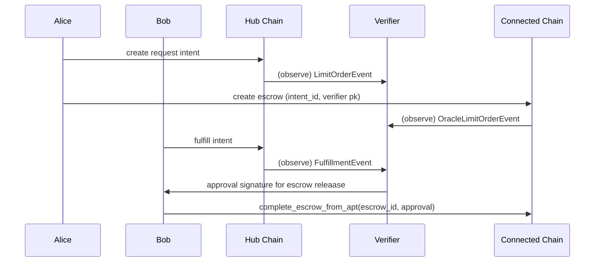

# Trusted Verifier - Overview and Guide

This service monitors a hub chain and a connected chain, links intents and escrows via `intent_id`, and provides Ed25519 approval signatures to authorize escrow release. It exposes a small REST API used by scripts and tools.

## Architecture

```
trusted-verifier/
└── src/
    ├── monitor/                  # polls both chains for module events, cache + approval storage; exposed via API
    ├── validator/                # validation (linking by intent_id, non‑revocable checks)
    ├── crypto/                   # Ed25519 key handling, approval signature creation 
    ├── api/                      # REST endpoints for health, events, approvals, public key
    ├── aptos_client.rs           # REST client for chain RPC
    ├── config/mod.rs             # TOML config structures and loader
    ├── lib.rs                    # library entry
    └── main.rs                   # binary entrypoint
```

## Guides and API

- Usage & flow guide: [guide.md](guide.md)
- API reference: [api.md](api.md)

## Cross‑Chain Flow (Overview)

1) Hub: Alice creates regular (non‑oracle) intent (emits `LimitOrderEvent`)
2) Connected: Alice creates escrow (non‑revocable), includes verifier public key, links `intent_id` (emits `OracleLimitOrderEvent`)
3) Hub: Bob fulfills the intent (emits `LimitOrderFulfillmentEvent`)
4) Verifier: observes fulfillment + escrow, generates approval signature (BCS(u64=1))
5) Script: submits `complete_escrow_from_apt` on connected chain with approval signature



